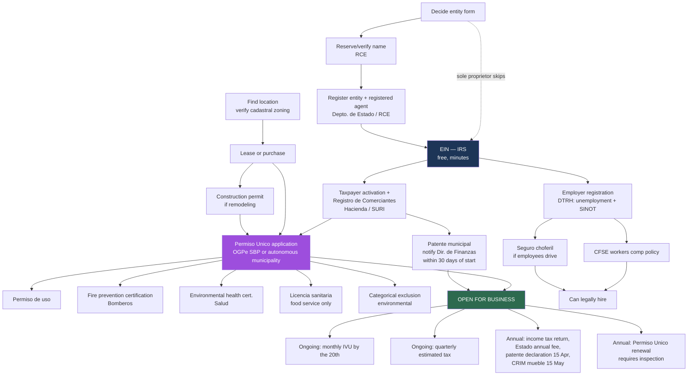

# Starting a Business in Puerto Rico — Primary-Source Research

**Research date:** 2026-08-06
**Purpose:** Knowledge base for an AI agent guiding entrepreneurs through business formation in Puerto Rico.
**Constituency focus:** small local retailers (CUD / Centro Unido de Detallistas), food service, and small professional-services firms.

> **How to read this document.** Every substantive claim carries an inline citation. Sources are tagged
> **[P]** = government primary source (statute, agency page, agency form/instruction) or
> **[S]** = secondary (law firm, professional association, blog, press).
> Where a claim rests **only** on a secondary source, it says so explicitly.
> Where I could not verify something, it is in **[Open questions](#open-questions--could-not-verify)** rather than guessed at.
>
> **A note on the legal texts used.** Puerto Rico's Oficina de Gerencia y Presupuesto maintains consolidated,
> amendment-incorporated versions of statutes at `bvirtualogp.pr.gov`. These carry a "Rev." date on every page and
> are the most current primary text I could obtain. The versions used here:
> Ley 164-2009 (Rev. 31 Jul 2025), Ley 107-2020 (Rev. **5 Aug 2026** — one day before this research),
> Ley 60-2019 (Rev. 16 Jul 2026), Ley 1-2011 (Rev. 28 May 2026), Ley 161-2009 (Rev. 14 May 2026).
> **Caveat:** at least one section of the OGP consolidated Ley 1-2011 is demonstrably stale (see
> [IVU rate](#7-sales-and-use-tax-ivusut)). Consolidated ≠ infallible.

---

## Table of contents

1. [TL;DR — the critical path](#tldr--the-critical-path)
2. [Dependency map](#dependency-map)
3. [Step-by-step detail](#step-by-step-detail)
4. [Cost summary by archetype](#cost-summary-by-archetype)
5. [Timeline summary](#timeline-summary)
6. [Variations by business type](#variations-by-business-type)
7. [Variations by municipality](#variations-by-municipality)
8. [Incentives — what's actually obtainable](#incentives--whats-actually-obtainable)
9. [Open questions / could not verify](#open-questions--could-not-verify)
10. [Sources](#sources)

---

## TL;DR — the critical path

For a typical small business with a physical location in Puerto Rico:

1. **Decide the entity form** (LLC / corporation / sole proprietorship-DBA) and, if forming an entity, **check name availability**.
2. **Register the entity** with the Departamento de Estado through the Registro de Corporaciones y Entidades (RCE) at `rcp.estado.pr.gov`. Requires a **registered agent with a Puerto Rico address** (Ley 164-2009, Art. 3.02 [P]).
3. **Get the federal EIN** from the IRS — free, online, issued in minutes ([irs.gov](https://www.irs.gov/businesses/small-businesses-self-employed/apply-for-an-employer-identification-number-ein-online) [P]).
4. **Register as a taxpayer with Hacienda** and obtain the **Certificado de Registro de Comerciantes** through SURI. Statutorily this must be filed **before you begin operating** (Ley 1-2011 §4060.01(b) [P]).
5. **Secure the location** (lease/purchase) and confirm the zoning/use of the *cadastral number* is compatible — check at `gis.jp.pr.gov/mipr` before signing anything ([permisos.pr.gov](https://www.permisos.pr.gov/) [P]).
6. **Apply for the Permiso Único (Single Business Permit)** through the Single Business Portal (`sbp.ogpe.pr.gov`). This one permit consolidates the use permit, categorical exclusion, fire prevention certification, environmental health certification and sanitary licenses (Ley 161-2009 Art. 8.4A [P]).
7. **Notify the municipality** and obtain the **patente municipal**. A brand-new business must notify the municipal Director de Finanzas **within 30 days of starting the activity**, and receives a *patente provisional exempt from payment* for that semester (Ley 107-2020, Art. 7.210 [P]).
8. **If hiring:** register as an employer with the Departamento del Trabajo (unemployment + SINOT), obtain a **CFSE workers' comp policy**, and register for **seguro social choferil** if any employee drives as part of the job.
9. **Set up ongoing tax compliance:** monthly IVU return (due the 20th), quarterly estimated income tax, annual income tax return, annual Departamento de Estado fee, annual patente declaration (15 April), annual CRIM personal property return (15 May).
10. **Only then** look at incentives (Act 60, BDE, SBA). For most corner stores this step is much smaller than the internet suggests — see [Incentives](#incentives--whats-actually-obtainable).

**Realistic elapsed time for a straightforward retail store: 6–14 weeks**, dominated almost entirely by the Permiso Único. Steps 1–4 can be done in under a week.

---

## Dependency map

### The hard blockers, stated plainly

| You cannot… | …until you have | Source |
|---|---|---|
| Open a business bank account | EIN (and entity docs, if an entity) | Practical/bank requirement — **[S]**, not a statute |
| Register as a merchant in SURI | A taxpayer ID (EIN or SSN) | Ley 1-2011 §4060.01(a) **[P]** |
| Legally operate | Permiso Único covering your use and location | Ley 161-2009 Art. 8.4A **[P]** |
| Apply for the Permiso Único meaningfully | A specific location with a cadastral number and compatible zoning | permisos.pr.gov application flow **[P]** |
| Get a licencia sanitaria (food) | Fire cert + premises + potable water certification | Requirements list — **[S]** (see [step 6](#6-fire-and-health-clearances)) |
| Legally hire employees | CFSE policy | Ley del Sistema de Compensaciones por Accidentes del Trabajo — **[S]** summary via CFSE **[P]** page |

**Note on ordering that agents commonly get wrong:** the Registro de Comerciantes must be filed *before* you begin to operate, not after (Ley 1-2011 §4060.01(b) [P]). But the Permiso Único application itself expects a Certificado de Registro de Comerciante among the documents the Sistema Unificado de Información collects (Ley 161-2009, Art. 2.4-ish enumeration [P]). So the merchant registration comes *before* the permit, not after. Practitioners frequently sequence this wrong.

---

## Step-by-step detail

### 1. Choose and form the legal entity

**Agency:** Departamento de Estado, Registro de Corporaciones y Entidades (RCE).
**Where:** [rcp.estado.pr.gov](https://rcp.estado.pr.gov/) (the old `prcorpfiling.estado.pr.gov` redirects here). Landing/orientation page: [estado.pr.gov/corporaciones](https://www.estado.pr.gov/corporaciones) [P].
**Prerequisite:** none. This is step one for anyone who wants liability protection.

#### The options

| Form | Liability shield | PR entity filing needed | Default PR tax treatment |
|---|---|---|---|
| **Sole proprietorship / DBA** | None — personal assets exposed | No RCE registration | Individual rates on Schedule; owner files individual return |
| **Corporation (Inc./Corp.)** | Yes | Yes — certificate of incorporation | Taxed as a corporation |
| **LLC (Compañía de Responsabilidad Limitada)** | Yes | Yes — certificate of organization | **Taxed as a corporation by default**, may elect partnership treatment |
| **Sociedad (partnership)** | Varies | Yes | Pass-through |

The Departamento de Estado's own guidance is blunt about the threshold question: *"Para hacer negocios en Puerto Rico usted no se tiene que incorporar"* — you do not have to incorporate to do business in PR; people incorporate primarily to protect personal assets ([Guía Básica de Incorporación, Depto. de Estado, July 2017](https://docs.pr.gov/files/Estado/Formularios%20mas%20buscados/GuiaBasicaCorp17Jul2017.pdf) [P] — **note this guide is from 2017 and its fee figures are stale**).

#### The PR-specific LLC tax wrinkle (important, frequently misunderstood)

Ley 164-2009 Art. 21.03(A) [P] provides that an LLC gets whatever tax treatment Ley 1-2011 (the PR Internal Revenue Code) assigns, and **may elect any other tax classification that law permits, if eligible**.

Under the PR Code:

- **Default: a PR LLC is taxed as a corporation.** This is the opposite of the US federal default for a multi-member LLC. It is the single most common trap for mainland entrepreneurs.
- An LLC **may elect** to be treated as a partnership (pass-through) under the partnership rules of Ley 1-2011.
- **Foreign (non-PR) LLCs cannot be treated as a corporation in PR if they are treated — by election or by operation of law — as a pass-through or disregarded entity under the US IRC of 1986** or an analogous foreign law. In that case PR treats them as pass-through entities. For tax years beginning after 31 Dec 2022, such single-member LLCs may elect disregarded-entity treatment in PR. *(This paraphrase rests on search-result summaries of Hacienda's Determinación Administrativa 22-10 and DA 23-01 — I could not fully retrieve the text of either. **Treat the specifics as unverified; verify against [DA 22-10](https://hacienda.pr.gov/publicaciones/determinacion-administrativa-num-22-10-da-22-10) and [DA 23-01](https://hacienda.pr.gov/publicaciones/determinacion-administrativa-num-23-01) before relying on it.**)*

**Practical consequence:** the PR election and the federal election are **separate**. A US-federal-disregarded single-member LLC is *not* automatically disregarded in PR. Getting this wrong means filing the wrong return and, potentially, double layers of tax. This is a "send them to a PR CPA" moment, not a self-serve one.

#### Registered agent

Every corporation must maintain a **designated office** and a **registered agent** in Puerto Rico. The agent may be: the corporation itself, an individual resident in PR, or a PR or foreign entity authorized to do business in PR, whose business office coincides with the corporation's designated office (Ley 164-2009 Art. 3.02(A) [P]). Same requirement applies to LLCs.

#### Filing fees — the statute and reality disagree

This is a genuine finding, so let me be precise.

**What the statute says (Ley 164-2009, Rev. 31 Jul 2025) [P]:**

- **Corporations, Art. 17.01(A)(1):** the incorporation fee is computed per authorized share (1¢/share for par-value shares up to 20,000, etc.), with a **floor of $100**. Nonprofits: **$5** minimum (Art. 17.01(C)(1)).
- **Corporations, Art. 17.01(A)(15):** *"Toda corporación doméstica o foránea deberá pagar derechos anuales por una suma que en ningún caso será menor de cien dólares ($100)."* — annual fee, **$100 floor**.
- **LLCs, Art. 21.01(A)(3):** **$50** to file a certificate of formation or organization. Name reservation: **$75**. Expedited service surcharges: **$100** (24 hrs), **$200** (same day), **$500** (within 2 hrs) (Art. 21.01(B)).
- **LLCs, Art. 21.03(B)–(C):** annual fee of **$100**, payable **1 March** of each year, with 1.5%/month interest if late and a **$100 penalty** (Art. 21.03(D)). Certificate of organization is **cancelled** after **three consecutive years** of nonpayment (Art. 21.02).

**What the government's own service portals say [P]:**

- LLCs "only pay annual fees of **$150.00** on or before **April 15**" and do **not** file an annual report ([csi.pr.gov/corporaciones](https://www.csi.pr.gov/corporaciones), a `.pr.gov` domain [P]; same figure at [estado.pr.gov/corporaciones](https://www.estado.pr.gov/corporaciones) [P]).
- The 2017 Depto. de Estado guide states **$150** for a for-profit corporation and **$5** for a nonprofit ([P], 2017 — stale).

**Why they differ:** Art. 17.02 and the closing line of Art. 21.01 both expressly authorize the Secretary of State to **modify the payable fees by circular letter or administrative order**. So the statutory figures are floors, and the currently-charged amounts are set administratively.

**What this means for the agent:** do **not** quote $50 or $100 as the LLC fee. The *observed current* figures are **$150 annual (LLC and corporation), due 15 April**, confirmed on two `.pr.gov` pages [P]. Secondary sources widely report **$250 to form an LLC** and **$150 to form a corporation** ([SL Accounting](https://accountingsl.com/blog/llc-vs-corporacion-dba-puerto-rico-2026/), [tramitarpr.com](https://tramitarpr.com/tramite/registros/registro-corporacion) [S]) — **I could not confirm the formation fees on any primary source.** See [Open questions](#open-questions--could-not-verify).

#### Annual report obligation — this changed in 2025

A real and recent change that most online guides have not caught up with:

- **For years prior to 2025:** every domestic corporation had to file a certified **annual report** by 15 April including a balance sheet, two officers' names/addresses, and (for corporations obligated under Ley 1-2011 §1061.15) audited financial statements (Ley 164-2009 Art. 15.01(A) [P]). Corporations with business volume **not exceeding $3,000,000** needed only an unaudited *Estado de Situación Financiera* (Art. 15.01(A)(1) [P]).
- **For 2025 and subsequent years:** *"no será necesario que las corporaciones organizadas al amparo de las leyes del Estado Libre Asociado radiquen el informe aquí dispuesto. No obstante, deberán cumplir con el pago del cargo anual descrito en el Artículo 17.01."* (Art. 15.01(C) [P]).
- **Same for foreign corporations** (Art. 15.03(D) [P]).
- **LLCs never had to file an annual report** — only the annual fee (csi.pr.gov [P]; consistent with Ley 164-2009 Ch. 21, which imposes only annual *derechos*).

So as of 2025+, the recurring Departamento de Estado obligation for both corporations and LLCs is **a payment, not a report**. The extension provision (Art. 15.02) references a **$150** filing charge for the extension request [P].

**Failure consequences:** a domestic corporation that fails to file the annual report for **two consecutive years** may have its certificate of incorporation revoked, with 60 days' prior notice (Art. 15.01, following paragraph [P]). An LLC that fails to pay annual fees for **three consecutive years** has its certificate of organization deemed cancelled (Art. 21.02(A) [P]), and ceases to be authorized to do business (Art. 21.03(G) [P]).

#### Foreign (non-PR) entity qualification

A foreign corporation wanting to do business in PR files for a **certificate of authorization**. Requirements per the Depto. de Estado service description [P]: a certificate of existence issued within the last 3 months, registered agent details, asset and liability amounts, the business purpose in PR, and director names/addresses. Statutory fee floor for the Art. 15.03 filings: **$100** (Art. 17.01(A)(8) [P]).

Note also: entities need a **Certificado de Cumplimiento Corporativo** (good standing) before contracting with government agencies (csi.pr.gov [P]); statutory fee floor **$15** for for-profits, free for nonprofits (Art. 17.01(A)(17), (C)(14) [P]).

**Timeline:** secondary sources report 24–72 business hours to 3–5 business days for online formation [S]. Statutorily, expedited tiers exist at $100/$200/$500 [P], which implies standard processing is slower than same-day.

**Pitfalls:**
- Choosing an LLC because "that's what I'd do stateside" without understanding the PR default-corporate treatment.
- Naming a registered agent with a P.O. Box — the statute contemplates a *designated office* address.
- Assuming the annual report still exists (it doesn't, for 2025+) and therefore assuming nothing is due — the **fee** is still due, and nonpayment eventually kills the entity.

---

### 2. Federal Employer Identification Number (EIN)

**Agency:** IRS.
**Where:** [irs.gov EIN online application](https://www.irs.gov/businesses/small-businesses-self-employed/apply-for-an-employer-identification-number-ein-online) [P]. Also by phone at 1-800-829-4933 (per the Depto. de Estado guide [P]).
**Prerequisite:** the entity should exist first if you are forming one — the EIN application asks for the legal entity name.
**Cost:** **$0.** The IRS states flatly: *"Beware of websites that charge for an EIN. You never have to pay a fee for an EIN."* [P]
**Timeline:** **immediate** — issued in minutes online, with a printable confirmation letter [P].

**Requirements [P]:**
- Principal place of business must be in the US or its territories (Puerto Rico qualifies).
- The applicant must be the **responsible party** in control of the entity, or an authorized representative, and must supply the responsible party's SSN or ITIN.
- **One EIN per responsible party per day.**
- Online hours: Mon–Fri 6:00 a.m.–1:00 a.m. ET, Sat 6:00 a.m.–9:00 p.m., Sun 6:00 p.m.–midnight.
- Applicants without a US-based principal place of business, or without an SSN/ITIN, must apply by phone, fax, or mail.

**Do you always need one?** A true sole proprietor with no employees can often use their SSN federally. But in PR you will need a taxpayer identification for the Registro de Comerciantes (Ley 1-2011 §4060.01 [P] contemplates identifying the persons with interest in the business), and practically, banks and the CFSE will want an EIN. **Get one — it's free and takes minutes.**

**Sequencing note:** after the EIN, the Depto. de Estado guide directs you to **activate as a taxpayer at Hacienda via Form SC 4809**, and then register in the Registro de Comerciantes ([Guía Básica de Incorporación](https://docs.pr.gov/files/Estado/Formularios%20mas%20buscados/GuiaBasicaCorp17Jul2017.pdf) [P] — 2017, but the sequencing logic still holds; the forms referenced there, SC 4809 and SC 2914, have since been folded into SURI).

---

### 3. Registro de Comerciantes (Merchant's Registration Certificate)

**Agency:** Departamento de Hacienda.
**Where:** SURI — [suri.hacienda.pr.gov](https://suri.hacienda.pr.gov/). Entry point: [hacienda.pr.gov/ivu/registro-de-comerciante](https://hacienda.pr.gov/ivu/registro-de-comerciante) [P].
**Prerequisite:** taxpayer ID (EIN or SSN); for entities, the certificate of incorporation/organization.

#### Who must register

*"Cualquier persona que desee llevar a cabo negocios en Puerto Rico como un comerciante, deberá presentar al Secretario una Solicitud de Certificado de Registro de Comerciantes para cada local comercial…"* — **Ley 1-2011 §4060.01(a)** [P]. Note **per commercial location**, listing the principal office address and every location where sales occur.

#### The deadline — before you open, not after

**Ley 1-2011 §4060.01(b)** [P]: *"La solicitud… deberá someterse al Secretario **antes de que la persona, empresa, sociedad o corporación comience a operar un negocio**…"*

This is a clean, unambiguous statutory rule: **file before you begin operating.** Many secondary guides say "within 30 days" — that 30-day rule is a *different* obligation: §4060.01(e) [P] requires notifying the Secretary of any **change** to the registered information, theft of the certificate, or total/partial cessation of operations **no later than 30 days after the change or event**.

#### Per-location rules

Hacienda's Carta Circular de Rentas Internas Núm. 16-12 [P] establishes that **SURI will not permit registering multiple locations with the same physical address**, and that multiple NAICS codes may be assigned to a single location to reflect different commercial activities, with one identified as primary. Separate registration is required for each distinct physical location.

#### Validity and renewal

Per **CC RI 16-12** [P]: new certificates **expire after two years** and require renewal following procedures set by the Secretary. Consistent with Hacienda's public materials on renewal through SURI [P].

#### Withholding vs. non-withholding agent

On approving the application, the Secretary designates the merchant as either a **withholding agent** (*agente retenedor*) or **non-withholding agent** for IVU purposes; the Secretary sets the classification criteria administratively (§4060.01(d) [P]). This determines whether you collect and remit IVU. Get this classification right at registration.

#### Cost

**No fee is specified anywhere in Ley 1-2011 §§4060.01–4060.07** [P], and no fee appears in CC RI 16-12 [P]. Secondary sources uniformly state the SURI process is **free** ([mistramitesyrequisitos.com](https://mistramitesyrequisitos.com/puerto-rico/certificado-de-registro-de-comerciante/) [S]). **Treated as free, but flagged: I could not find an affirmative primary statement that it costs $0.**

#### Related statutory duties

- **§4060.02** — the certificate must be **displayed** [P].
- **§4060.03** — conducting commercial business without a registration certificate is a violation [P].
- **§4060.06** — document retention requirement [P].
- **Penalty:** CC RI 16-12 [P] notes a **$500 penalty** for failure to update registration, and that noncompliance blocks filing import and sales tax returns.

**Pitfalls:**
- Opening the doors "for a soft launch" before the certificate is issued — that is operating without registration.
- Registering one location and then opening a second without a separate registration.
- Letting the two-year certificate lapse. There is no grace period stated in the statute.

---

### 4. Municipal obligations

There are **two separate municipal taxes** and they are commonly conflated:

- the **patente municipal** — a tax on *gross business volume*, paid to the municipality; and
- the **contribución sobre la propiedad** — property tax on real and personal property, administered by **CRIM** (Centro de Recaudación de Ingresos Municipales) on behalf of the municipalities.

#### 4a. Patente municipal

**Governing law:** **Ley 107-2020, Código Municipal de Puerto Rico**, Libro VII, Capítulo III (Arts. 7.200–7.2xx), 21 L.P.R.A. §§8161 et seq.

> **Important correction for anyone reading older material:** the patente municipal was historically governed by **Ley 113 de 10 de julio de 1974 ("Ley de Patentes Municipales")**. That law is **DEROGADA (repealed)** — the OGP consolidated PDF of Ley 113 is stamped "DEROGADA" on every page — and was replaced by Ley 107-2020. The substantive rate provisions were carried over nearly verbatim, so most secondary guidance is still *substantively* right but *cites the wrong statute*. Cite Ley 107-2020, not Ley 113.

**Who pays.** Anyone engaged for profit in providing any service, selling any good, any financial business, or any industry or business in a municipality (Art. 7.201 [P]).

**Rate ceilings (Art. 7.202) [P]:**

| Business type | Maximum rate on business volume attributable to the municipality |
|---|---|
| **Financial business** | **1.50%** (Art. 7.202(a)) |
| **All other businesses** (services, sales of goods, any other industry/business) | **0.50%** — literally *"cincuenta centésimas (.50) del uno por ciento (1%)"* (Art. 7.202(b)) |

- These are **ceilings**, not fixed rates. Municipalities may impose **lower** rates to incentivize a business, industry sector, or geographic area — including graduated/tiered rates by volume, phased rates reaching the maximum over 2 years, and full exemption to attract new investment. Any such reduction must be **uniform for businesses of the same nature within each industry and commercial sector** (Art. 7.202(c) [P]).
- **Minimum:** the amount payable is the computed figure **or $25, whichever is greater** (Art. 7.202(d) [P]).
- **Multiple business types in the same municipality:** each is taxed separately at its own rate on its own volume base (Art. 7.203 [P]).

**Base.** Business volume for the accounting year ending in the immediately preceding calendar year; the accounting year must match the one used for the PR income tax return. **If the business did not operate for the full prior year, volume is annualized** (Art. 7.204(a) [P]).

**Exemptions (Art. 7.206) [P]:**
- Business or industry operated by/for a federal, state, or municipal agency, subdivision, or instrumentality.
- **Business volume not exceeding $5,000** — exempt.
- Income received as an employee of an employer as defined in Ley 1-2011.

**Filing — Declaración de Volumen de Negocios (Art. 7.207) [P]:**
- **Due within 5 business days following 15 April** of each tax year. (Note: it is *five business days after* 15 April, not "on 15 April" — a small but real difference.)
- For businesses covered by a tax exemption decree that file under §1061.16(e) of the PR Code, the deadline is **5 business days following 15 June**.
- If the Secretary of Hacienda postpones the income tax return deadline by Administrative Determination, **every municipality is obligated to postpone the Declaration deadline by the same period**, and the postponed date becomes the original filing date for all purposes.
- **Mandatory attachments (Art. 7.207(b)):** copies of the pages/schedules detailing gross income and operating expenses as submitted to Hacienda with the income tax return, plus a certification from the taxpayer that they are true and exact copies. **A declaration filed without this certification is considered not filed.**
- **Audited financial statements (Art. 7.207(c)):** any business obligated under Ley 1-2011 §1061.15 to submit audited FS — or that voluntarily submits them — must file them with the volume declaration. **Failure to attach them = not filed.**
- The municipality may, at its discretion, require evidence that you are current on real and personal property taxes, or have an active payment plan, at the time of filing (Art. 7.207(e) [P]).
- File with the **Director de Finanzas** where the principal office is located, **and a copy to the Director de Finanzas of every municipality** where you earned taxable income (Art. 7.207(f) [P]).

**Payment (Art. 7.208) [P]:**
- Paid **in advance within the first 15 days of each semester** of the fiscal year.
- Patentes come due in **semiannual installments on 1 July and 2 January**.
- **5% discount** on the total patente if the full payment is made at the time the declaration is filed.
- No patente is charged for semesters after the one in which the business ceased operating.

**New businesses (Art. 7.210) [P] — this is the "new business exemption" people ask about:**

> *"Toda persona que comenzare cualquier industria o negocio de nueva creación sujeta al pago de patente estará obligada a notificarlo al Director de Finanzas del municipio correspondiente, **a más tardar treinta (30) días después de comenzar tal actividad**. El Director de Finanzas le extenderá una **patente provisional exenta de pago por el semestre correspondiente a aquél en que comienza dicha actividad**."*

So: notify within 30 days of starting; you get a payment-exempt provisional patente for **that semester only**. At the start of the next semester you file a computed declaration and pay the full amount for that semester at filing.

**Occasional sales (Art. 7.200(j)) [P]:** a business wanting to make occasional sales must acquire a **provisional patente** in that municipality, and report volume within 24 hours of the activity ending. Businesses whose occasional-sales volume is under **$7,000** satisfy the obligation with the provisional patente payment. (Relevant for pop-ups, fairs, kiosks.)

**Municipal contracts (Art. 7.200(k)) [P]:** volume from municipal contracts is attributed to the contracting municipality regardless of where the contractor's office is; a contractor without physical presence there must buy a provisional patente.

**Penalties (carried into Ley 107-2020 from Ley 113) [P]:** 5% addition for negligence; 50% for fraud; 10%/yr interest; surcharges of 0% (≤30 days late), 5% (31–60 days), 10% (>60 days).

#### 4b. Property tax — CRIM

**Agency:** Centro de Recaudación de Ingresos Municipales (CRIM). Portal: [crim360.com](https://portal.crim360.com/) and [emueble.crimpr.net](https://emueble.crimpr.net/) [P].

- **Personal property return (planilla de bienes muebles):** due **on or before 15 May** each year (Código Municipal, Art. corresponding to 21 L.P.R.A. §8094 [P], via [Justia's reproduction of the 2020 code](https://law.justia.com/codes/puerto-rico/2020/titulo-21/subtitulo-8/parte-vii/capitulo-359/8094/) [P-adjacent]). This covers business inventory, machinery, equipment, furniture and fixtures.
- **The $50,000 valuation exemption:** available to a merchant engaged directly in **retail sales of goods and non-professional services**, requiring: no debt from prior years, filing on or before 15 May, and **net sales volume or service income not exceeding $150,000 annually**. **The exemption is not automatic — it must be requested.** *(Source: [Colegio de CPA de Puerto Rico](https://www.colegiocpa.com/crim-contribucion-sobre-la-propiedad-mueble-exoneraciones-y-reclamaciones/) **[S]** — a professional association, not a government agency. It cites "Ley 83, Artículos 5.35 y 5.36." **I did not verify this against the statute text. Flag as secondary-only.**)*
- **Failure to file penalties:** 5% of the unpaid amount if ≤30 days, plus 5% for each additional 30-day period, **capped at 25%** (Código Municipal, property tax chapter [P]).
- A **5% discount** exists for payment with the extension (Código Municipal, property tax chapter [P]).
- Real property tax rates vary by municipality; the Código Municipal references a municipal base contribution of **up to 2%** plus the 0.20-of-1% resarcimiento component [P].

**This matters most for retail.** A store carrying inventory has a real personal-property tax exposure that a home-office consultant does not. The $50,000 exemption is meaningful for a small store — and is easy to miss because it must be affirmatively claimed.

---

### 5. Permits — the Permiso Único (Single Business Permit)

**This is the long pole in the tent.** Everything else is days; this is weeks.

**Agency:** Oficina de Gerencia de Permisos (OGPe), **or** an autonomous municipality with delegated hierarchy I–V.
**Where:** Single Business Portal — [sbp.ogpe.pr.gov](https://sbp.ogpe.pr.gov/). Orientation: [permisos.pr.gov](https://www.permisos.pr.gov/) [P].
**Legal basis:** Ley 161-2009, **Art. 8.4A** (added by Art. 28 of Ley 19-2017) [P].

#### What it is and what it consolidates

**Ley 161-2009 Art. 8.4A** [P]:

> *"Todo edificio existente o nuevo, con usos no residenciales, así como todo negocio nuevo o existente, obtendrá el Permiso Único para iniciar o continuar sus operaciones, el cual incluirá: **permiso de uso; certificación de exclusión categórica; certificación para la prevención de incendios; certificación de salud ambiental; licencias sanitarias; y cualquier otro tipo de licencia o autorización aplicable** requerida para la operación de la actividad o uso del negocio."*

The purpose is to consolidate these into a single application. **OGPe is the entity charged with issuing the certifications and licenses needed for a Permiso Único** [P] — meaning you do not, in the design, go agency-by-agency.

Further rules in Art. 8.4A [P]:
- **A Permiso Único can only be requested when the application includes the authorization for the use of the business or project.** No use authorization, no Permiso Único.
- **Anyone holding a current use permit who requests an amendment or name change must file a Permiso Único application.** This is how the old *permiso de uso* regime is being converted over.
- **The validity period is set by the Reglamento Conjunto**, not by the statute.
- **Renewal requires an inspection** by OGPe, an Authorized Professional, or the autonomous municipality. The Reglamento Conjunto specifies the rigor of the inspection.
- If an inspection finds unauthorized uses that *are* permitted in the zoning district, you may amend the Permiso Único by paying the applicable charges for the prior year **as a penalty**. If the unauthorized use is *not* permitted in the district, **the Permiso Único cannot be renewed** and a new application is required.
- The Sistema Unificado de Información sends expiration notices to the project owner and property owner.
- Renewal of a compliant Permiso Único for existing commercial/institutional buildings **is not reviewable or appealable** by third parties. For amendments, review is limited to the amended activity.

There is also a **Permiso Único Incidental Operacional** which can bundle tree-cutting authorization, general consolidated permits, general permits for other works, incidental extraction, and simple permits (Art. 8.4A [P]).

#### The application process

Per [permisos.pr.gov](https://www.permisos.pr.gov/) [P], six steps:

1. **Verify land use eligibility via the cadastral number** at [gis.jp.pr.gov/mipr](https://gis.jp.pr.gov/mipr/). *Do this before signing a lease.*
2. Review applicable requirements.
3. Check relevant specialized licenses for your sector.
4. Create a user account in the SBP.
5. Establish a project profile in SBP.
6. Submit the Permiso Único application.

The application flow requires: cadastral number or map location, owner information, proposed business use, environmental compliance documentation, mandatory selection of the Health License and Fire Prevention Certificate, and attachments (memorial explicativo, sketch, location photos) ([ayudalegalpr.org guide](https://ayudalegalpr.org/resource/gua-para-solicitar-permiso-nico) [S], which describes a 22-screen flow).

Documents the Sistema Unificado de Información collects from the proponent are statutorily limited to: *Memorial Explicativo; copy of valid ID of the authorized person; evidence of employer Social Security number; **Certificado de Registro de Comerciante**; copies of Patentes Municipales; copy of Permiso de Uso; and the Exclusión Categórica* (Ley 161-2009 [P]). **This confirms the ordering: merchant registration and patente come before, or alongside, the permit application.**

#### Cost

**You pay 10% of the calculated cost at filing**; after evaluation, you are told the final cost and pay the balance ([ayudalegalpr.org](https://ayudalegalpr.org/resource/gua-para-solicitar-permiso-nico) [S]; [citaogpepr.com](https://www.citaogpepr.com/permiso-unico/) [S]). The total varies by business type because each bundled license carries its own fee. **I could not locate the current OGPe fee schedule (tabla de cargos y derechos) on a primary source** — see [Open questions](#open-questions--could-not-verify).

Known component fees from the Bomberos side ([bomberos.pr.gov/permisos](https://bomberos.pr.gov/permisos) [P]):
- Mobile businesses: **$60**
- Substitute homes/daycares (≤6 people): **$60–$80** by square footage
- Fire protection systems plan review: **$100**
- Flammable/combustible liquid tank installation: **$100**
- Consultations and amendments: **$100**
- Special events: **$20–$300+**
- Residential building common areas: **$10 per floor**

A secondary source reports fire inspection filing "begins at $100 per use" with a $100 internal revenue voucher for account 5300 [S].

#### Professionals Autorizados (PA) and Inspectores Autorizados (IA)

Certified private professionals — engineers, architects — authorized to process **ministerial** permits and perform inspections in place of OGPe, dramatically shortening timelines. **Authorized Professionals may issue all permits, determinations, licenses and certifications within the jurisdiction of Autonomous Municipalities with hierarchy I–III when those acts are ministerial** [S — search-result paraphrase of Ley 161-2009 provisions; the statutory text was not directly retrieved for this specific claim].

There is a **Reglamento de Regulación de Profesionales ante la OGPe**, with a revision accepted by OGPe dated 4 Sept 2025 ([docs.pr.gov PDF](https://docs.pr.gov/files/DDEC/Aviso%20Pu%CC%81blico/Revisi%C3%B3n-III%20FOMB-(9.4.2025)Reglamento%20Regulaci%C3%B3n%20Profesional-FINAL%20aceptado%20OGPe.pdf) [P]) — I did not fully parse it.

**Practical guidance:** for anything beyond the simplest change-of-name on an existing use permit, hiring a PA is standard practice and usually pays for itself in elapsed time. This is a "reasonable professional expense," not a shortcut.

#### ⚠️ The Reglamento Conjunto is legally unstable — a real finding

The Permiso Único's validity period, fees, and inspection standards all live in the **Reglamento Conjunto**, and that regulation has been repeatedly litigated:

- The **Reglamento Conjunto 2020** took effect **2 January 2021** ([jp.pr.gov](https://jp.pr.gov/reglamento-conjunto-2020/) [P]).
- On **15 March 2023**, the **Tribunal Supremo de Puerto Rico unanimously confirmed** the Court of Appeals' decision **declaring the Reglamento Conjunto 2020 null**, because it lacked the executive summary and cost-benefit analysis required by §2.5(b) of the Ley de Procedimiento Administrativo Uniforme. **No government agency may use the 2020 Joint Regulation.** The Court held OGPe was not an indispensable party and that the **Junta de Planificación** must determine which regulation currently governs ([Microjuris](https://aldia.microjuris.com/2023/03/15/supremo-confirma-decision-del-tribunal-de-apelaciones-sobre-el-reglamento-que-expide-permisos-relacionados-al-desarrollo/) [S]; [Sin Comillas](https://sincomillas.com/tribunal-supremo-declara-nulo-el-reglamento-conjunto-de-2020/) [S]; [Metro PR](https://www.metro.pr/noticias/2023/03/15/detienen-proceso-de-aprobacion-de-permisos-luego-de-que-el-supremo-declarara-nulo-el-reglamento-conjunto-2020/) [S]). The 2015 version had previously been annulled by the Court of Appeals as well.
- A **new joint regulation took effect 7 June [2023]**, consolidating classification districts from 50 to 22 [S].
- Litigation continues: *Fideicomiso v. Lassus*, with written comments expected in **October 2025**, described as "determinative for the future of the Reglamento Conjunto" ([UPR Law Review, In Rev, 1 Oct 2025](https://derecho.uprrp.edu/inrev/2025/10/01/el-reglamento-conjunto-como-espejo-de-la-gobernanza-ambiental-en-puerto-rico-trayectoria-normativa-controversias-judiciales-y-desafios-institucionales/) [S — academic]).

**What this means for the agent:** **do not state the Permiso Único validity period as a fixed number of years.** I could not determine the currently-operative Reglamento Conjunto or its stated validity period from a primary source. Ley 161-2009 says renewal requires inspection and that OGPe sends expiration notices — but the interval is regulatory, and the regulation has been in flux since 2023. Multiple secondary sources say the Permiso Único is renewed **annually** ([Piloto 151](https://intercom.help/piloto151/en/articles/6371413-operating-a-business-in-puerto-rico) [S]; [DLA Piper](https://www.dlapiper.com/en-be/insights/publications/2019/07/changes-to-puerto-rico-business-permitting-process) [S]). **Flag this as secondary-only and tell the user to confirm the expiration date on their own permit document.**

#### Autonomous municipalities with delegated permit authority

**Ley 161-2009** [P] recognizes **Municipios Autónomos con Jerarquía de la I a la V**. Where a municipality holds a delegation agreement and hierarchy transfer, it has **total exclusivity** to issue final determinations and permits within the scope of that agreement — you go to the municipality, **not** OGPe.

The Código Municipal (Ley 107-2020) [P] describes what each hierarchy tier covers, e.g.:
- **Jerarquía I:** construction consultations, construction permits, use permits, sign permits; projects under 1,000 m² of construction, ≤4 stories, on lots under 1,500 m²; segregation of up to 10 lots.
- **Jerarquía II:** projects under 5,000 m², ≤4 stories, on lots under 4,000 m²; preliminary development authorizations; urbanization of up to 50 lots; ordinance plan amendments for lots ≤2,000 m²; use/intensity variances up to 4,000 m².
- **Jerarquía III:** transfer of further OGPe and Junta de Planificación powers — use and intensity variances, industrialized construction systems of subregional impact, location consultations, ordinance plan amendments for lots >2,000 m², and most sign permits (excluding National Highway System–related, communication antennas, and reserved items). **A municipality may not issue a use permit if the necessary infrastructure is unavailable.**

**Which municipalities?** As of **15 August 2016**, the municipalities authorized to grant permits under signed agreements were: **Aguadilla, Barranquitas, Bayamón, Cabo Rojo, Caguas, Carolina, Cidra, Guaynabo, Humacao, Ponce and San Juan** ([Estadísticas.PR / OGPe](https://estadisticas.pr/en/taxonomy/term/1333) [P]). More recently, the **Municipio Autónomo de Aguadilla** requested transfer of Hierarchies I, II and III by municipal ordinance ([lexjuris OM-29-2024-2025](https://www.lexjuris.com/ordenanzas/Aguadilla/2024-2025/OM-29-2024-2025.pdf) [P — municipal ordinance]), and a validation-optimization first phase incorporated **20 municipalities** including the **consorcio ABC (Aibonito, Barranquitas, Comerío)** [S].

**This 2016 list is almost certainly incomplete and possibly out of date.** See [Open questions](#open-questions--could-not-verify). **The agent should tell users to check whether their municipality has delegated authority rather than assuming OGPe.**

#### Construction permits

If you are remodeling or building out, a **construction permit** precedes the use permit / Permiso Único. Under Ley 161-2009 and the Ley de Certificación de Planos (Ley 135-1967, amended by Ley 122-2024 [P]), certified plans by an authorized professional can substitute for conventional review in defined cases. **I did not research the construction permit track in depth** — it is a separate workstream, usually driven by the architect/engineer of record.

---

### 6. Fire and health clearances

Both of these are **components of the Permiso Único**, not standalone prerequisites — but they are the components most likely to fail an inspection and stall everything.

#### Fire — Negociado de Bomberos de Puerto Rico

**Where:** [bomberos.pr.gov](https://www.bomberos.pr.gov/) — Prevención division; permits at [bomberos.pr.gov/permisos](https://bomberos.pr.gov/permisos) [P]. Prevention Division: (787) 725-3444 [S].

The **Certificación para la Prevención de Incendios** is issued as part of the use permit evaluation, by OGPe's Health and Safety Unit, an Authorized Professional, or an Authorized Inspector [S]. Any person or entity establishing a business of any use or occupation must request an inspection of the premises **before it is occupied or begins operations** [S].

**Baseline requirements for establishments under 1,000 sq ft** ([bomberos.pr.gov/permisos](https://bomberos.pr.gov/permisos) [P]):
- Fire extinguishers: **5 lb ABC, one per 75 feet**
- Emergency lighting on evacuation routes
- AEE-compliant electrical systems
- Doors opening **outward** for evacuation

Fee schedule as listed on the Bomberos permits page — see [step 5](#5-permits--the-permiso-único-single-business-permit).

**Pitfall:** doors opening inward is a classic retail buildout mistake that fails inspection and requires physical rework.

#### Health — Departamento de Salud

**Where:** [salud.pr.gov](https://www.salud.pr.gov/) — División / Secretaría Auxiliar de Salud Ambiental [P].

Two distinct things:

**(a) Certificación de Salud Ambiental** — the *environmental health endorsement*, issued as part of the use permit evaluation by OGPe's Health and Safety Unit or by an Authorized Professional/Inspector, to the owner/operator/administrator of a public establishment [S]. Bundled into the Permiso Único.

**(b) Licencia Sanitaria** — the *sanitary license*, required for any person, corporation or institution starting a **food business, children's care center, or elderly care center** [S]. Also bundled into the Permiso Único per Ley 161-2009 Art. 8.4A [P].

**Prerequisites for the licencia sanitaria** (per practitioner guidance — **[S] only**, see [foodbusinesspr.com](https://www.foodbusinesspr.com/post/obtenga-su-licencia-sanitaria) and [foodsafetycertificationpr.com](https://foodsafetycertificationpr.com/requisitos-licencia-sanitaria/)):
- Premises already leased
- Bomberos certification already obtained
- Patentes municipales
- Potable water system certified by the Departamento de Salud
- Copy of the commercial use license
- Copy of plans and specifications of the establishment
- **A pre-operational sanitary inspection**

**Costs** — from the Departamento de Salud regulation at [app.estado.gobierno.pr/ReglamentosOnLine/Reglamentos/5975.pdf](http://app.estado.gobierno.pr/ReglamentosOnLine/Reglamentos/5975.pdf) [P] and secondary summaries:
- Sanitary license filing: **from $35**, depending on operation type [S]
- **Restaurant/food establishment inspection: $100** [P via regulation summary]
- **Food factory/processor inspection (incl. water, soft drink, juice bottlers): $100** [P via regulation summary]

**Food handler certification.** A **Certificación de Manejo Seguro de Alimentos** is required, obtainable through the National Registry of Food Safety Professionals (or ServSafe), **valid for three years** [S]. Separately, individual **Certificados de Salud** are issued by the Departamento de Salud's División de Certificados de Salud ([salud.pr.gov/CMS/DOWNLOAD/1621](https://www.salud.pr.gov/CMS/DOWNLOAD/1621) [P]) — I did not fully parse the current requirements or cost.

**Realistic expectation setting:** the practitioner guidance is candid — *"su costo es razonable pero debes estar preparado a esperar semanas antes de que te inspeccionen el local y emitan el permiso"* [S]. Weeks, not days.

---

### 7. Sales and Use Tax (IVU / SUT)

**Agency:** Departamento de Hacienda.
**Where:** SURI. Return: **Modelo SC 2915** (Planilla Mensual de Impuesto sobre Ventas y Uso), filed electronically.

#### Rate

**Combined 11.5%** = **10.5% state + 1% municipal**.

- The **1% municipal** rate is squarely in the primary text: since **1 February 2014**, all municipalities *uniformly and obligatorily* impose a SUT at a **fixed rate of one percent (1%)**, collected by the municipalities (Ley 1-2011, municipal SUT provisions [P]).
- The **10.5% state** rate: Hacienda's own publications state the state IVU rate *"was changed from 6% to 10.5%, while the municipal IVU remains at 1%, making the total applicable rate 11.5%"* ([Carta Circular de Política Contributiva Núm. 15-09 and related 2015 circulars, hacienda.pr.gov](https://hacienda.pr.gov/publicaciones/carta-circular-de-politica-contributiva-num-15-09) [P]).

> **⚠️ Primary-source anomaly worth recording.** The OGP consolidated text of **Ley 1-2011 §4020.01(b)** (Rev. 28 May 2026) still reads: *"La tasa contributiva será de un cinco punto cinco por ciento (5.5%)… disponiéndose que, efectivo el 1ro. de febrero de 2014 la tasa contributiva será de seis por ciento (6%)."* The string "10.5%" / "diez punto cinco" **does not appear anywhere in the 1,104-page consolidated PDF.** The 10.5% rate was imposed by **Ley 72-2015**. Either the consolidation missed that amendment, or the additional 4.5% sits in a provision I did not locate. **This is a documented gap in an otherwise excellent primary source.** The operative rate is 11.5% — Hacienda says so and every merchant collects it — but if the agent ever cites §4020.01 for the rate, it will be citing the wrong number.

#### The 4% B2B / designated professional services special rate

**Effective 1 October 2015**, a **special state IVU of 4%** applies to:
- **services rendered to other merchants** ("B2B"), and
- **designated professional services**.

**These services are NOT subject to municipal IVU** — the full 4% is remitted to Hacienda ([hacienda.pr.gov, Aplicación del IVU al 4%](https://hacienda.pr.gov/aplicacion-del-ivu-al-4-sobre-servicios-entre-comerciantes-y-servicios-profesionales-designados-partir-del-1-de-octubre-de-2015) [P]; see also Determinaciones Administrativas [15-17](https://hacienda.pr.gov/publicaciones/determinacion-administrativa-num-15-17), [15-21](https://hacienda.pr.gov/publicaciones/determinacion-administrativa-num-15-21), [15-23](https://hacienda.pr.gov/publicaciones/determinacion-administrativa-num-15-23), [17-07](https://hacienda.pr.gov/publicaciones/determinacion-administrativa-num-17-07) [P]).

**Designated professional services** [P]: legal services; agronomists; architects and landscape architects; certified public accountants; real estate brokers/salespeople/companies; professional delineators; professional real estate appraisers; geologists; engineers and surveyors.

**Is it still in effect?** Hacienda has continued to publish about it (including a press release exhorting merchants registered as designated professionals to update their registration [P]), and I found no repeal. **Treated as still applicable, but I did not find a 2025- or 2026-dated Hacienda confirmation.** Flag it.

**This is the single most important IVU fact for the professional-services archetype** — a consultant billing PR businesses charges 4%, not 11.5%, and none of it goes to the municipality.

#### Registration, filing and remittance

- **Registration** is via the Registro de Comerciantes (see [step 3](#3-registro-de-comerciantes-merchants-registration-certificate)). Your classification as **withholding vs non-withholding agent** determines your collection duty (Ley 1-2011 §4060.01(d) [P]).
- **Monthly return due by the 20th day of the month following the transaction month**, electronically (Ley 1-2011 §4041.02 [P] — the statute sets the 20th for the Monthly Import Tax return and the SUT returns are governed by the same section; the 20th is also the figure Hacienda and every practitioner source states).
- The return **must be filed even if there were no taxable transactions for the period** [P].
- Municipal IVU is remitted through the merchant-seller's monthly return for the month of sale [P].
- **Importers:** a **Declaración de Importación** is required, and the Monthly Import Tax Return is due by the **20th**. A **bonded** importer (*comerciante afianzado*) may take possession of goods before paying the use tax, at the Secretary's discretion, taking into account volume and frequency (Ley 1-2011 §4041.03(b) [P]). **This is the bond mechanism** — it is an optional facility for importers, not a general requirement to open a business.
- **Economic nexus for remote sellers:** $100,000 in gross receipts or 200 transactions per year triggers registration and collection at 11.5% [S — reported by multiple tax-compliance vendors; I did not locate the primary threshold citation].

#### Exemptions

Exemptions are in Ley 1-2011, Subtítulo D, Capítulo 3 [P]. I did **not** enumerate them. The ones that matter most for a corner store — unprepared food, prescription medicines — are widely reported but I did not verify them against the statute. **Flagged as unresearched.**

**Pitfalls:**
- Filing the return but not remitting, or vice versa.
- Not filing a zero return in a month with no sales.
- Charging 11.5% on B2B services that should be 4%, or 4% on retail that should be 11.5%.
- Forgetting that the municipal 1% goes to the municipality where the sale occurred — relevant if you have locations in more than one municipality.

---

### 8. Income tax

#### PR corporate income tax

**Normal tax:** **18.5%** of net income subject to normal tax, per Ley 1-2011 §1022.01 ([Hacienda, Instrucciones Planilla de Corporaciones 2025](https://hacienda.pr.gov/sites/default/files/inst_corporaciones_2025.pdf) [P]).

**Surtax (contribución adicional)** — table for tax years beginning after 31 Dec 2012 [P]:

| Net income subject to surtax | Surtax |
|---|---|
| Not over $75,000 | 5% |
| $75,001 – $125,000 | $3,750 + 15% of excess over $75,000 |
| $125,001 – $175,000 | $11,250 + 16% of excess over $125,000 |
| $175,001 – $225,000 | $19,250 + 17% of excess over $175,000 |
| $225,001 – $275,000 | $27,750 + 18% of excess over $225,000 |
| Over $275,000 | $36,750 + 19% of excess over $275,000 |

**Surtax deduction: $25,000** (one $25,000 credit for an entire controlled group owned 80%+ by the same persons; prorated among members; Form SC 2652 filed through SURI reports the allocation) [P].

**Top combined marginal rate: 18.5% + 19% = 37.5%.**

**Alternative Minimum Tax (contribución alternativa mínima)** [P]:
- Imposed when net income, adjusted for preference items, exceeds the **$50,000** exempt amount.
- Rate: **18.5%**, but **not less than $500**.
- **Corporations with business volume ≥ $10,000,000 are subject to a 23% rate.**
- Not applicable to: foreign corporations not engaged in PR trade or business; pass-through entities; registered investment companies under Subchapter L; Ley 8-1987 corporations (exempt income only); exempt REITs; tourism-law corporations (exempt income only); bona fide farmers (exempt income only); special worker-owned corporations.

**Optional tax for service corporations — §1022.07** [P]. This is a big deal for the professional-services archetype. A corporation whose income comes **substantially** from providing services may elect a flat tax **on gross income** in lieu of the normal tax, surtax, and AMT:

| Gross income | Optional tax rate |
|---|---|
| Not over $100,000 | **6%** |
| $100,001 – $200,000 | **10%** |
| $200,001 – $300,000 | **13%** |
| $300,001 – $400,000 | **15%** |
| $400,001 – $500,000 | **17%** |
| Over $500,000 | **20%** |

Conditions [P]: at least **80%** of gross income must have been subject to withholding or reported on informative declarations; **no expenses or deductions may be claimed**; the corporation is **not** subject to AMT; effective for tax years beginning after 31 Dec 2018. Reported on **Anejo X Corporación**.

**Young entrepreneur / PYME rate.** A corporation with an *Acuerdo para la Creación o Retención de Empleos* that constitutes a **PYME Elegible Nueva** under **Ley 120-2014** pays a normal tax of **5% in year 1, 10% in year 2, 15% in year 3** [P]. Separately, under **Ley 135-2014** / Ley 60-2019 §2100.01, young entrepreneurs get an exemption on the **first $500,000 of gross income** of a new business for the first 3 years from signing the Agreement with the Compañía de Comercio y Exportación, with amounts above $500,000 taxed at ordinary rates [P]. **These are genuinely relevant to small local businesses** — far more so than Act 60 Chapter 3.

**Filing deadline.** Domestic or foreign corporations engaged in business in PR file no later than the **15th day of the 4th month** following the close of the tax year — **15 April** for calendar-year filers ([Hacienda, procesos y requisitos](https://hacienda.pr.gov/individuos/contribucion-sobre-ingresos/prorrogas/procesos-y-requisitos) [P]). Automatic extension via **Modelo SC 2644** [P].

**Estimated tax** [P]: four installments, on the **15th day of the 4th, 6th, 9th, and 12th months** of the tax year. If the obligation first arises later in the year, the remaining installments are compressed (e.g., obligation arising after month 8 and before the 15th of month 12 → entire estimated tax due on the 15th of the 12th month). **Penalty: 10% of the unpaid amount of any installment** (§6041.10). Estimated tax = the lesser of 90% of the current year's tax, or a prior-year safe harbor. Paid electronically through SURI. Reported on **Anejo T**.

#### Financial statement thresholds — the numbers that trigger extra cost

From [Hacienda, Instrucciones Planilla de Corporaciones 2025](https://hacienda.pr.gov/sites/default/files/inst_corporaciones_2025.pdf) [P]:

| Business volume | Requirement |
|---|---|
| **< $1 million** | **No financial statements required.** May *voluntarily* submit an AUP (Agreed Upon Procedures, under CC RI 19-14) or audited FS to claim deductions subject to validation for AMT purposes under §1022.04. |
| **$1M – <$3M** | **Audited FS not required.** But voluntarily submitting an AUP (CC RI 19-14) or audited FS removes the §1022.04 deduction limitations. |
| **$3M – <$10M** | **Must submit, at its election, either audited FS or an AUP under CC RI 20-39**, prepared by a PR-licensed CPA. Doing so removes the §1022.04 deduction limitations. |
| **≥ $10 million** | **Must submit audited financial statements** by a PR-licensed CPA. |

Also: a business current on its tax responsibility that elects to include audited FS or the AUP under CC RI 20-39 **may be relieved, wholly or partly, from withholding on payments received for services rendered** [P] — a meaningful cash-flow benefit.

Note the **$3,000,000** threshold recurs across three different regimes: audited FS election point (Hacienda), the Estado de Situación Financiera simplification for corporate annual reports (Ley 164-2009 Art. 15.01 [P]), and the accelerated depreciation election on **Anejo E1** for businesses with gross income ≤$3,000,000 [P].

#### Individual income tax (relevant to pass-throughs and sole proprietors)

**Ley 1-2011 §1021.01(a)(3)**, for tax years beginning after 31 December 2012 [P]:

| Net income subject to tax | Tax |
|---|---|
| Not over $9,000 | **0%** |
| $9,001 – $25,000 | 7% of excess over $9,000 |
| $25,001 – $41,500 | $1,120 + 14% of excess over $25,000 |
| $41,501 – $61,500 | $3,430 + 25% of excess over $41,500 |
| Over $61,500 | $8,430 + **33%** of excess over $61,500 |

There is a **gradual adjustment** clawing back the benefit of the below-33% brackets and the personal/dependent exemptions for higher incomes (§1021.01(b) [P]), and a separate **Contribución Básica Alterna a Individuos** (§1021.02 [P]) which I did not tabulate.

**Note:** these brackets are unchanged in the 28 May 2026 consolidated text, meaning the 2012 table is still the operative one. Verify no 2026 legislation changed them before relying on it.

#### Federal treatment — IRC §933 and self-employment tax

**The core rule.** Income from **Puerto Rico sources** earned by a **bona fide resident of Puerto Rico** is **excluded from US federal income tax under IRC §933** — except salaries and pensions received as a civilian or military employee of the US government ([IRS Publication 1321, Oct 2025](https://www.irs.gov/pub/irs-pdf/p1321.pdf) [P]).

**Bona fide residency test** [P]: during the tax year you must meet the **presence test**, have **no tax home outside PR**, and have **no closer connection** to the US or a foreign country than to PR.

**Self-employment tax is NOT excluded.** This is the point most people get wrong. Bona fide PR residents with income effectively connected with a trade or business in Puerto Rico must file **Form 1040-SS** (or its Spanish-language equivalent, Form 1040-PR) to report self-employment income and **pay federal self-employment tax** — Social Security and Medicare ([IRS Pub. 1321](https://www.irs.gov/pub/irs-pdf/p1321.pdf) [P]). Filing is required if: net self-employment earnings ≥ **$400**, you are a bona fide PR resident, and you are not otherwise required to file a standard Form 1040. *(Note: for tax year 2023 onward the IRS consolidated Form 1040-PR into Form 1040-SS, with the Spanish version still available under the 1040-PR name — **[S]**, per tax-software documentation; verify current-year form names.)*

**Practical summary for the agent:**

| Situation | US federal income tax | US self-employment tax | PR income tax |
|---|---|---|---|
| Bona fide PR resident, PR-source business income, sole prop | Excluded under §933 | **Yes — pay it** | Yes |
| Bona fide PR resident with any non-PR-source income | Files Form 1040 for the non-PR portion | Yes | Yes on PR-source |
| PR corporation, PR-source income only | Generally not a US filer on that income | N/A (corp) | Yes |
| Employees | — | Employer/employee FICA applies normally | PR withholding |

**Employees in PR are covered by US Social Security and Medicare normally.** Puerto Rico is inside the US payroll tax system even though it is largely outside the US income tax system. A business with employees pays FICA and files federal employment tax returns. **The territory is not a payroll-tax haven.**

**Caution flag:** the IRS has publicly increased scrutiny of PR tax benefit claims ([Holland & Knight, Sept 2025](https://www.hklaw.com/en/insights/publications/2025/09/trouble-in-paradise-the-irs-is-taking-a-hard-look-at-puerto-rican-tax) [S]). Advice in this area should be conservative.

---

### 9. Employer obligations

Trigger: **hiring your first employee.** None of this applies to a solo owner-operator with no staff (though the CFSE has an individual-owner track — see below).

#### (a) Departamento del Trabajo y Recursos Humanos (DTRH) — unemployment + SINOT

**Where:** [trabajo.pr.gov](https://www.trabajo.pr.gov/) — Portal de Servicios al Patrono; [servicio_contributivo.asp](https://www.trabajo.pr.gov/servicio_contributivo.asp) [P].

- One registration obtains an **Employer Number** for both **Seguro por Desempleo** (unemployment insurance) and **SINOT** (Seguro por Incapacidad No Ocupacional Temporal — temporary non-occupational disability) [P].
- New employers enroll directly online; existing employers are pre-registered with credentials sent by letter [P].
- **Taxable wage bases** [P]: **$7,000/year for unemployment**; **$9,000/year for SINOT**.
- Contribution categories: **Unemployment, SINOT, and a Special Contribution** [P].
- The **Fondo Especial** to combat unemployment is funded by an employer special contribution equal to **1% of taxable wages** [P].
- **Actual contribution rates are experience-rated and not published as a single number** — the portal "calculates contribution responsibility based on current rates" [P]. **I could not obtain the 2026 new-employer rate.** See [Open questions](#open-questions--could-not-verify).

#### (b) Corporación del Fondo del Seguro del Estado (CFSE) — workers' compensation

**Where:** [cfse.pr.gov](https://www.cfse.pr.gov/en) — Patronos section [P]. Phones: 1-844-POLIZAS, 1-844-PATRONO, 1-855-ELFONDO [P].

- **Every person who employs one or more people**, long-term or for specific work, **must hold a CFSE policy** [P/S]. This is a monopoly public insurer — there is no private workers' comp market to shop.
- The Departamento de Estado incorporation guide lists it flatly: *"Como patrono también es necesario obtener póliza del Fondo del Seguro del Estado"* [P].
- **For individual business owners and independent contractors** [P]: complete an **individual** application (corporate entities and LLCs are **not** accepted on that track), present a copy of the income tax filing or a sworn statement, and provide a **Merchant Registration Certificate or Certificate of Exemption**. **Note the dependency: CFSE wants your Registro de Comerciantes.**
- A **new workers' compensation regulation for employers and individual business owners** was reported in **April 2025** ([Microjuris](https://aldia.microjuris.com/2025/04/04/nuevo-reglamento-de-seguro-obrero-para-patronos-y-duenos-de-negocio-individual-lo-que-debes-saber/) [S]) — **I did not obtain or review the regulation text.**

**Why it bites:** operating without a CFSE policy strips the employer of the exclusive-remedy protection and exposes them to direct tort liability for workplace injury. This is not a paperwork formality.

#### (c) Seguro Social Choferil (chauffeur's insurance) — Ley 428 de 15 de mayo de 1950

**Where:** [trabajo.pr.gov/seguro_choferil.asp](https://www.trabajo.pr.gov/seguro_choferil.asp) and the **PSSCH** application [P]. Central office (787) 754-5353 ext. 2486/2419/2455; regional offices in Arecibo, Caguas, Mayagüez, Ponce [P].

**Who is covered** [P]: employees whom the employer **requires or permits to drive a motor vehicle usually and regularly** as an integral part of their work, for any number of hours in a week; plus self-employed drivers in authorized public transportation. An "employer" for this purpose includes anyone who **owns, has usufruct of, possesses, leases or administers one or more motor vehicles**, or employs one or more such drivers.

**Excluded** [P]: administrators, executives, professionals, federal employees, and those previously receiving bonification benefits.

**Contributions** [P]:
- **Employer: $0.30 per week per covered employee**
- **Employee deduction: $0.50 per week**
- **Self-employed driver: $0.80 per week**

**Why this matters for retail:** a store with a delivery driver, or an employee who runs supply errands in a company vehicle, is in scope. This obligation is trivially cheap and very commonly overlooked.

#### (d) New hire reporting

Employers must report new hires to **ASUME** (Administración para el Sustento de Menores), PR's child support enforcement agency. Reported details include employee name, address, SSN, date of birth, date of hire, state of hire, and salary. **Reporting deadline: 20 days after the employee's first day**, and the hire must be reported **even if the employee quits or is fired before the 20 days elapse**. *(Source: [Labor Law Center](https://www.laborlawcenter.com/education-center/human-resource-new-hire-reporting-in-puerto-rico/) **[S]** and payroll-provider guides **[S]**. **I could not find a primary ASUME or DTRH page stating the 20-day rule. Flag as secondary-only.**)*

#### (e) PR labor law basics that bite immediately

**Ley 4-2017 (Reforma Laboral)** substantially rewrote PR's employment rules. What matters on day one:

**Vacation and sick leave accrual** — the monthly-hours threshold to accrue was raised from **115 to 130 hours per month** by Ley 4-2017 (amending Ley 180-1998) [S — Microjuris summary; I was unable to download the OGP consolidated Ley 180-1998].

*For employees hired on or after 26 January 2017* [S]:

| Service | Vacation accrual |
|---|---|
| First year | **½ day/month** |
| Years 2–5 | **¾ day/month** |
| Years 6–15 | **1 day/month** |
| Over 15 years | **1¼ days/month** |

**Sick leave: 1 day per month worked, for all employees**, accruing **from the start of the probationary period** [S].

> **These accrual figures come from [Microjuris](https://aldia.microjuris.com/2017/03/14/conoce-las-leyes-enmendadas-por-la-reforma-laboral/) and payroll-vendor summaries — [S] only.** The underlying statute is Ley 180-1998 as amended by Ley 4-2017. **Verify against the statute before relying on these numbers.** Employees hired *before* 26 Jan 2017 are grandfathered into the older, more generous schedule.

**Probationary period** [S]: Ley 4-2017 Art. 8 sets probationary periods by category; employees classified as executives, administrators and professionals under the FLSA and DTRH regulations have an **automatic 12-month** probationary period.

**Bono de Navidad (Christmas bonus)** — Ley 148-1969 as amended by Ley 4-2017 and later Ley 41-2022 amendments:

*For employees hired **on or after** 26 January 2017* [S]:
- Requires **≥700 hours** worked in the applicable period (1 Oct – 30 Sep).
- **Employers with 21+ employees: 2% of salary, max $600.**
- **Employers with 20 or fewer: 2% of salary, max $300.**

*For employees hired **before** 26 January 2017* [S]:
- Requires **≥1,350 hours** worked between 1 Oct and 30 Sep.
- **6% of total salary up to $10,000, max $600**; smaller employers **3%, max $300**.

*First-year employees whose first year began after 26 Jan 2017* receive **50%** of the otherwise-applicable bonus [S].

**Payment deadline: no later than 15 December**, unless an extension is requested from the Departamento del Trabajo under extraordinary circumstances [S].

> **All bono de Navidad figures above are [S]** — from [Microjuris (Nov 2025)](https://aldia.microjuris.com/2025/11/28/quien-tiene-derecho-al-bono-de-navidad-en-puerto-rico/), [ayudalegalpr.org](https://ayudalegalpr.org/resource/gua-rpida-sobre-el-bono-de-navidad), and [SHRM Puerto Rico](https://www.shrmpr.org/lo-que-debemos-saber-sobre-los-cambios-en-el-pago-del-bono-de-navidad/). The primary texts are at [Ley 148-1969 (OGP)](https://bvirtualogp.pr.gov/ogp/Bvirtual/leyesreferencia/PDF/Sueldos/148-1969.pdf) [P] — **which I did not parse.** The 20-employee threshold and the dollar caps are the details most likely to have shifted; **verify before use.**

**The 20-employee cliff is a real planning consideration for a growing retailer** — crossing from 20 to 21 employees doubles the per-employee bonus cap.

---

## Cost summary by archetype

**Every figure below is "as of" the date shown. Fees marked ⚠️ are unverified against a primary source.**

### Archetype A — Retail store (CUD's core constituency)
*Small store, leased ~1,000 sq ft, 2 employees, ~$250,000 annual volume, in a municipality at the 0.50% patente rate.*

| Item | Cost | As of | Source tag |
|---|---|---|---|
| LLC formation (Depto. de Estado) | ⚠️ ~$250 (statutory floor $50) | 2026 | [S] / [P] floor |
| EIN | **$0** | 2026 | [P] |
| Registro de Comerciantes | **$0** (assumed) | 2026 | ⚠️ [S] |
| Permiso Único (incl. fire + environmental health) | ⚠️ **$300–$800 est.** — no published schedule found | — | ⚠️ unverified |
| Bomberos component fees | $60–$100+ per item | 2026 | [P] |
| Patente municipal, year 1 | **$0** for the opening semester (Art. 7.210 provisional) | 2026 | [P] |
| Patente municipal, steady state @ $250,000 volume, 0.50% | **$1,250/yr** (or $25 minimum, whichever greater) | 2026 | [P] |
| CRIM personal property tax on inventory/equipment | varies; **$50,000 valuation exemption available** if volume ≤$150,000 | — | ⚠️ [S] |
| CFSE workers' comp policy | varies by payroll and classification — **not published** | — | ⚠️ unverified |
| DTRH unemployment + SINOT | experience-rated; bases $7,000 / $9,000 | 2026 | [P] |
| Seguro choferil (if any driver) | **$0.30/wk employer + $0.50/wk employee** | 2026 | [P] |
| Registered agent (if outsourced) | ⚠️ market rate, not a government fee | — | [S] |
| **Est. government fees to open** | **⚠️ roughly $550–$1,100** | — | mixed |
| **Est. annual recurring** | **$150 Estado + $1,250 patente + IVU/income tax + CRIM + insurance** | — | mixed |

### Archetype B — Food service (restaurant / cafetería)
*Same size, plus kitchen. Heaviest permit burden.*

Everything in Archetype A, plus:

| Item | Cost | As of | Source tag |
|---|---|---|---|
| Licencia sanitaria filing | **from $35**, by operation type | 2026 | [S] |
| Restaurant/food establishment inspection | **$100** | — | [P] via reg. summary |
| Potable water system certification | ⚠️ not found | — | unverified |
| Food safety manager certification (NRFSP / ServSafe) | ⚠️ market rate; **valid 3 years** | 2026 | [S] |
| Individual Certificados de Salud for handlers | ⚠️ not found | — | unverified |
| Construction/buildout permit (kitchen, hoods, grease trap) | ⚠️ not researched | — | unverified |
| Fire protection systems plan review (hood suppression) | **$100** | 2026 | [P] |
| **Additional est. government fees** | **⚠️ $250–$600+ beyond retail baseline** | — | mixed |
| **Additional elapsed time** | **+3 to 8 weeks** for health inspection cycle | — | [S] |

### Archetype C — Professional services (consultant, engineer; home office or small office)
*Solo or 1–2 people, ~$150,000 revenue.*

| Item | Cost | As of | Source tag |
|---|---|---|---|
| LLC or corporation formation | ⚠️ ~$150–$250 | 2026 | [S] |
| EIN | **$0** | 2026 | [P] |
| Registro de Comerciantes | **$0** (assumed) | 2026 | ⚠️ [S] |
| Permiso Único | **May be avoidable if working from home with no client traffic** — but Art. 8.4A applies to *"todo negocio nuevo o existente"*. ⚠️ **See Open questions.** | — | ⚠️ |
| Patente municipal @ $150,000, 0.50% | **$750/yr**; **$0 first semester**; **$0 if volume ≤$5,000** | 2026 | [P] |
| Professional licensing / colegiación | Engineers: license from Junta Examinadora **+ active CIAPR membership** and colegiación dues | 2026 | [P] |
| CRIM personal property | minimal — a laptop and a desk | — | — |
| CFSE / DTRH | **N/A if no employees** | — | — |
| **Est. government fees to open** | **⚠️ roughly $150–$400** | — | mixed |
| **Est. annual recurring** | **$150 Estado + $750 patente + taxes** | — | mixed |

**The tax picture is what actually distinguishes archetype C:** billing PR businesses means **4% IVU**, not 11.5%, and a service corporation may elect the **§1022.07 optional tax at 6% of gross** up to $100,000 of gross income — often dramatically simpler and cheaper than the 18.5% + surtax regime, at the cost of forfeiting all deductions [P].

---

## Timeline summary

| Step | Elapsed time | Runs in parallel with |
|---|---|---|
| Entity formation | **1–5 business days** (expedited tiers exist at $100/$200/$500) | — |
| EIN | **Minutes** (online, immediately after formation) | — |
| Registro de Comerciantes (SURI) | **Same day to a few days** | Location search |
| Location search + lease negotiation | **2–8 weeks** | Entity/EIN/SURI |
| Zoning verification (cadastral) | **Same day** — do it before signing | — |
| Construction / buildout permit (if remodeling) | **Weeks to months** ⚠️ not researched | — |
| **Permiso Único** | **⚠️ Weeks. Health inspection alone "semanas" per practitioners [S]** | Patente notification, employer registration |
| Patente municipal notification | Within **30 days after starting** activity | Permit process |
| DTRH employer registration | **Days** (online) | Permit process |
| CFSE policy | ⚠️ not verified | Permit process |
| **Realistic total, retail** | **6–14 weeks** | |
| **Realistic total, food service** | **10–20+ weeks** | |
| **Realistic total, professional services from home** | **1–2 weeks** if no Permiso Único needed | |

**What runs in parallel:** entity → EIN → SURI is a strict serial chain but takes under a week total. Everything after that — permitting, municipal notification, employer registrations — can proceed concurrently. **The critical path is: find location → verify zoning → sign lease → Permiso Único.**

**What you cannot compress:** the Permiso Único inspection cycle. Hiring an Authorized Professional is the main available lever [S].

---

## Variations by business type

### Retail (store)

- **Heaviest CRIM personal property exposure** — inventory is taxable. The **$50,000 valuation exemption** for retail merchants with net sales ≤$150,000 is the single most valuable and most overlooked item [S].
- **Full 11.5% IVU** on sales of tangible goods; you are almost certainly a **withholding agent**.
- **Municipal 1%** goes to the municipality of sale — matters if you expand to a second location in a different municipality.
- **Patente at 0.50%** of gross volume, not profit. **This is a tax on revenue, not income** — a low-margin grocery pays it regardless of profitability. This is structurally the harshest tax on a corner store and the reason municipal rate variation matters so much.
- If you import inventory: **Declaración de Importación** and the Monthly Import Tax Return by the 20th; consider the **bonded importer** facility to take possession before paying use tax (Ley 1-2011 §4041.03(b) [P]).
- Fire clearance: outward-opening doors, extinguishers, emergency lighting [P].

### Food service (restaurant / cafetería)

Everything in retail, plus:

- **Licencia sanitaria** with a **pre-operational inspection** — the longest-lead item [S].
- **Potable water system certification** by the Departamento de Salud [S].
- **Plans and specifications** of the establishment must be submitted [S].
- **Food safety manager certification** (NRFSP/ServSafe), valid 3 years [S].
- Buildout almost always triggers a **construction permit** — hoods, grease interceptors, ventilation.
- **Fire protection system plan review ($100)** for hood suppression [P].
- Practitioners are explicit that the sequencing is: **lease → Bomberos → patente → licencia sanitaria** [S], i.e. the sanitary license is *last*, after everything else.
- Recurring inspections: **$100 per restaurant inspection** [P via regulation summary].

**Honest framing for a prospective restaurateur:** budget **3+ months** and expect at least one failed inspection. This is the archetype where a professional (PA/IA, or a permitting consultant) most clearly pays for itself.

### Professional services (consultant, engineer, accountant)

- **Lightest permit burden.** If home-based with no client traffic, whether a Permiso Único is required is genuinely unclear — Art. 8.4A says *"todo negocio nuevo o existente"* obtains one, but OGPe's framing is about *"actividades comerciales, industriales, institucionales u otros usos que **no están relacionados con la habitación**"* [P]. ⚠️ **See Open questions.**
- **IVU at 4%, not 11.5%**, for services to other merchants and for **designated professional services** (legal, agronomy, architecture/landscape architecture, CPA, real estate brokerage, delineators, real estate appraisal, geology, engineering and surveying). **No municipal component** [P]. Services to individual consumers are treated differently — verify per engagement.
- **§1022.07 optional tax** at 6%–20% of gross is often the right structure — 6% up to $100,000 gross, no deductions, no AMT [P].
- **Colegiación is a real gate for some professions.** For engineers and surveyors: you must hold a current license from the **Junta Examinadora de Ingenieros y Agrimensores** **and be an active member of the CIAPR** — colegiación has been a legal requirement since Ley 41 de 1927, reaffirmed by Leyes 399 and 173 of 1988 ([CIAPR](https://www.ciapr.org/colegiacion/) [P — professional body with delegated statutory authority]). CPAs: licensing requirements were updated by **Ley 174-2025**, harmonizing education/experience criteria with national standards and promoting interstate mobility [S].
- **No CFSE / DTRH obligations if genuinely solo.** But note the CFSE **individual owner** track exists and requires an individual application (not accepted for corporate entities/LLCs) plus a Merchant Registration Certificate [P].
- **Self-employment tax still applies federally** even though PR-source income is excluded under §933 [P]. Budget ~15.3% on net earnings.

---

## Variations by municipality

Municipality choice materially changes cost. **Ley 107-2020 Art. 7.202(c)** [P] expressly lets municipalities set rates **below** the 0.50% / 1.50% ceilings, including **tiered rates by volume** and outright exemptions to attract investment — as long as treatment is uniform within an industry/sector.

The **Colegio de CPA de Puerto Rico** publishes an annual table of every municipality's rates. The most current I found is **[Tipos Contributivos de Patentes Municipales 2025-2026](https://www.colegiocpa.com/wp-content/uploads/2025/03/Tipos-Contributivos-de-Patentes-Municipales-2025-2026.pdf)** (March 2025) [S — professional association, not government]. Prior year: [2024-2025](https://www.colegiocpa.com/wp-content/uploads/2024/04/2024-25-Tipos-Contributivos-pdf.pdf) [S].

> **Extraction caveat.** These are multi-column PDFs and my text extraction produced column drift on some rows. Figures below marked ✅ were cross-checked against a second source; those marked ⚠️ come from the CPA table alone with possible row/column misalignment. **The agent must not present ⚠️ rows as authoritative — send the user to the municipality's own ordinance.**

### Fiscal year 2025-2026 — selected municipalities

| Municipality | Financial | Non-financial | Notes |
|---|---|---|---|
| **San Juan** ✅ | 1.50% | **Tiered:** ≤$12,500 **exempt**; $12,501–$100,000 **flat $25**; $100,001–$300,000 **0.20%**; >$300,001 **0.50%** | Cross-confirmed by two independent secondary sources. Filing at [tramite.sanjuan.pr](https://tramite.sanjuan.pr/); **electronic filing compulsory**. |
| **Bayamón** | 1.50% | 0.50% | Filing via [ivubayamon.org/sifmr](https://www.ivubayamon.org/sifmr). Municipal page confirms: declaration by **15 April + 5 business days**, semiannual payment within first 15 days of each semester, **5% discount** for paying in full at filing, new businesses notify within **30 days** and get a payment-exempt provisional patente ([municipiodebayamon.com](https://www.municipiodebayamon.com/servicios-municipales/empresas/patente-municipal/) [P — municipal]). Bayamón's page **does not publish its rate**; it points to the (now-repealed) Ley 113. |
| **Caguas** | 1.50% | 0.50% | Filing via Caguas/Recaudador Virtual. |
| **Carolina** | 1.50% | 0.50% | Filing at [municipiocarolina.com](https://www.municipiocarolina.com/servicios-en-linea/). |
| **Guaynabo** | 1.50% | 0.50% | Filing at [epay.guaynabocity.gov.pr](https://epay.guaynabocity.gov.pr/epay/Portada.aspx). |
| **Ponce** ⚠️ | 1.50% | **Appears tiered:** ≤$499,999 **0.30%**; >$500,000 **0.50%** | ⚠️ Column alignment uncertain — could belong to a neighbouring row. Filing at [ponce.recaudadorvirtual.com](https://ponce.recaudadorvirtual.com/). |
| **Mayagüez** ⚠️ | 1.50% | 0.50%, possibly tiered ≤$150,000 **0.30%**; $150,001–$500,000 **0.40%**; >$500,001 **0.50%** | ⚠️ Same alignment caveat. Filing at [mayaguez.recaudadorvirtual.com](https://mayaguez.recaudadorvirtual.com/). |
| **Peñuelas** | **1.25%** | **0.40%** | A clear example of below-ceiling rates. |
| **Camuy** (2024-25 table) | 1.50% | <$5,000 = **$25**; $5,000–$200,000 = **0.40%**; >$200,001 = **0.50%** | Tiered. |

### What actually varies by municipality

1. **The patente rate and tiering.** San Juan effectively exempts micro-businesses (≤$12,500) and charges a flat $25 up to $100,000 of volume — a genuine advantage for a very small retailer. Peñuelas charges 0.40% instead of 0.50% across the board.
2. **Whether the municipality has delegated permit authority.** If yes, you deal with the municipality, not OGPe, and the timeline and process differ. Known delegated municipalities as of 2016: Aguadilla, Barranquitas, Bayamón, Cabo Rojo, Caguas, Carolina, Cidra, Guaynabo, Humacao, Ponce, San Juan [P]. ⚠️ Likely incomplete/outdated.
3. **Filing platform.** There is no single system. The CPA table shows a patchwork: **Recaudador Virtual**, **Monet One**, **IVU Bayamón**, **epay Guaynabo**, municipality-specific portals, email, mail, and in-person only. Some municipalities have **no electronic filing at all**. San Juan makes electronic filing **compulsory**; most do not.
4. **Local incentive ordinances.** Municipalities can and do enact them. Examples found: **Fajardo** established staggered rates for newly created non-financial businesses [S]; **San Juan** Ordinance 46, series 2025-26 exempts contractors from patente on affordable-housing construction volume [S]; San Juan runs a business-incentive portal at [emprendimiento.sanjuan.pr](https://emprendimiento.sanjuan.pr/) [P — page returned 404 on fetch].
5. **Whether the municipality demands property-tax currency at patente filing** — discretionary under Art. 7.207(e) [P].

**Agent guidance:** for any specific user, look up (a) their municipality's current patente ordinance, (b) whether it has delegated permit authority, and (c) its filing platform. Do not generalize from San Juan.

---

## Incentives — what's actually obtainable

### Blunt assessment first

**Act 60 Chapter 3 (Export of Goods and Services) is essentially irrelevant to a corner store, a neighborhood restaurant, or any business selling to people in Puerto Rico.** The entire chapter is premised on services being rendered for the benefit of **Personas Extranjeras** with **no Nexo with Puerto Rico** (Ley 60-2019 §2031.01(b) [P]). A store selling to residents of Bayamón has, by definition, a nexus with Puerto Rico. Do not pad advice with it.

**The Act 60 individual-investor chapter (§§2021.01, 2022.01–2022.02) is a personal tax regime for people relocating to PR with investment income. It is not a business incentive.** It has nothing to do with opening a store.

**What *is* realistically obtainable for a small local business:**

1. **The Ley 107-2020 Art. 7.210 new-business patente exemption** — automatic, costs nothing, and most owners don't claim it because they don't notify within 30 days. **[P]**
2. **The CRIM $50,000 personal property exemption** for retail merchants with net sales ≤$150,000 — must be affirmatively requested. **[S]**
3. **Ley 120-2014 PYME rates** — 5% / 10% / 15% normal tax in years 1–3 for a "PYME Elegible Nueva" with an employment agreement. **[P]**
4. **Ley 135-2014 / Ley 60 §2100.01 young entrepreneur** — exemption on the first **$500,000 of gross income** for 3 years, for owners aged **16–35** with a high school diploma (or enrolled), via an Agreement with the Compañía de Comercio y Exportación. **[P]**
5. **§1022.07 optional tax** for service corporations — 6% of gross up to $100,000. **[P]**
6. **BDE and SBA financing.**
7. **Municipal incentive ordinances** — check locally.

### Act 60 / Ley 60-2019 — accurate current terms

Source throughout: **[Ley 60-2019, OGP consolidated, Rev. 16 July 2026](https://bvirtualogp.pr.gov/ogp/Bvirtual/leyesreferencia/PDF/60-2019.pdf)** [P].

#### Chapter 3 — Export of Goods and Services (§§2031.01–2034.01)

**Eligibility (§2031.01(a))** [P]: any Person with a **bona fide office or establishment located in Puerto Rico** carrying out enumerated service activities. The list is long and includes: R&D; advertising and PR; economic/environmental/technological/scientific/managerial/marketing/HR/IT/audit consulting; advisory services on any industry or business; creative industries; construction plans, engineering and architecture and project management; **professional services such as legal, tax and accounting**; centralized management services (headquarters); electronic data processing centers; software development; cloud/blockchain distribution and licensing/subscription revenue; telecommunications to persons outside PR; **call centers**; shared services centers; educational and training services; hospital and laboratory services including medical tourism and telemedicine; investment banking and other financial services; marketing centers; and a catch-all for anything the DDEC Secretary designates.

**The export test (§2031.01(b))** [P]: the service must be rendered for the benefit of (1) a Foreign Person, (2) a trust whose beneficiaries/settlors/trustees are not PR residents, (3) an estate whose decedent/heirs/legatees/executors are not PR residents, or (4) a Person doing business in PR **but only where the services have no Nexo with Puerto Rico** and are destined for that Person's own client meeting the above conditions — **in every case, provided the services have no Nexo with Puerto Rico**.

**Benefits:**

| Benefit | Term | Citation |
|---|---|---|
| **4% fixed preferential income tax** on net export services / promoter services income, in lieu of any other income tax | 15 years | §2032.01(a) [P] |
| **4% fixed preferential income tax** on net export trade income | 15 years | §2032.02(a) [P] |
| **75% exemption** on municipal and state **property taxes** (personal and real) used in the exempt activity | 15 years | §2032.03(a) [P] |
| **50% exemption** on **municipal taxes / patentes municipales** on the exempt business volume | 15 years | §2032.04(a) [P] |
| **100% exemption** for shareholders/partners/members on distributions of earnings from Export Services Income; subsequent distributions also exempt | — | §2032.01(e) [P] |
| 12% tax on royalties to foreign persons not engaged in PR trade/business | — | §2032.01(b) [P] |

**General decree term:** 15 years (§6020.03(a) [P]); **extendable** on showing the extension is in PR's best economic and social interests (§6020.03(c) [P]). *(The widely quoted "15 + 15 = 30 years" [S] is consistent with an extension being available but the statute does not state a fixed 15-year extension length in the text I read.)*

**Base period limitation (§2032.01(c)–(d))** [P] — important anti-abuse rule: if the applicant was already engaged in export services at application, or in the prior 3 tax years, only the *increment* over the base period average gets the 4% rate. Base period income is taxed at ordinary rates and is **reduced by 25% annually until it reaches zero in the 4th year** of the decree.

**Employment requirement (§1030.01)** [P] — much narrower than commonly stated:

> The employment requirement applies **only to an Exempt Business with actual or projected annual business volume greater than $3,000,000**. For such businesses:
> - **Chapter 3 (export) decrees: 1 full-time direct employee.**
> - **Chapter 6 (manufacturing) decrees: 3 full-time direct employees.**
> - **All other chapters: no job-creation requirement.**
>
> The Secretary may impose a higher requirement considering PR's best interests.

**Flexible compliance (§1030.01(e))** [P]: meeting ≥80% of required jobs is deemed compliance; this exception may not be used more than **3 times** during the decree term. Below 80%, the business must petition the Secretary.

**Full-time employee counting (§2062.01(j))** [P]: total hours worked by all direct employees ÷ **2,080**, truncating decimals. Vacation and authorized leave count as hours worked; **overtime beyond 40 hrs/week does not**.

**Application cost.** Per **Reglamento Núm. 9414 (DDEC, 27 October 2022)** [P]:
- **Negocio de Exportación de Bienes y Servicios** (Subtítulo B, Cap. 3, §§2031.01 and 2031.02): **$5.00 transaction fee + $1,000.00 service fee**.
- **Individuo Residente Inversionista** (§2021.01): **$5.00 + $1,000.00**.
- **Promotor Cualificado** (§2034.01): **$5.00 + $5,000.00**.
- Applications are filed through the **DDEC Online / Incentives portal** ([incentives.ddec.pr.gov](https://incentives.ddec.pr.gov/) [P]).
- ⚠️ **Reglamento 9414 is from 2022. Verify these fees are current** — DDEC has issued subsequent circular letters, e.g. [OIN 2025-006 (3 May 2025)](https://incentives.ddec.pr.gov/pdf/opendocs/Carta%20Circular%20DDEC%20(OIN)%202025-006%205.3.25.pdf) and [OIN 2025-015 (21 Oct 2025)](https://docs.pr.gov/files/DDEC/Aviso%20Pu%CC%81blico/Carta_Circular_DDEC_OIN_2025-015%20Registro_Profesional_Certificado.pdf) [P], which I could not parse (scanned PDFs).

**Annual reporting (§6020.10)** [P]: annual reports are filed electronically through the Incentives Office portal with fees set by regulation; the information feeds the biennial **Certificado de Cumplimiento** evaluation by a Compliance Professional. **For tax years beginning after 31 Dec 2024, the report — including the compliance report — must be filed electronically with the Secretary of Hacienda as part of the exempt business's income tax return**, with the corresponding fee. Failure to file, or late filing, exposes the business to an administrative fine of **up to $10,000** (§6020.10(e) [P]). An incomplete report counts as not filed if the omission is not cured within **15 days** of notice.

#### Chapter 6 — Manufacturing (§§2061.01–2063.01)

**Eligible activities (§2061.01(a))** [P] include: any Industrial Unit permanently established for **commercial-scale production of a Manufactured Product**; certain units producing non-eligible products but only as to products sold abroad; units performing part of the process outside PR for competitiveness reasons; bona fide offices/establishments providing **Servicios Fundamentales a Conglomerados de Negocios** or **Servicios de Suplidor Clave**; **Propiedad Dedicada a Desarrollo Industrial**; and raising animals for laboratory research.

**Exemption term: 15 years** (§2062.05(a) [P]).

**Municipal exemption (§2062.05)** [P]: **total exemption** from municipal taxes/patentes on business volume during the **semester in which the exempt business begins operations in any municipality**, plus **total exemption for the two semesters of the fiscal year(s) following** that semester. *(Note the statute's own footnote acknowledging Ley 113 was repealed and replaced by Libro VII, Cap. III of Ley 107-2020 — the Incentives Code text still cross-references the old law.)*

**Start-of-operations flexibility (§2062.05(e))** [P]: the business elects the start date (first training or production payroll, construction start, or any date within 2 years of first payroll); may postpone application of the fixed rate up to 2 years; must begin commercial-scale operations within **1 year** of signing, extendable but never beyond **5 years** from approval.

**Additional locations (§2062.05(e)(5)(ii))** [P]: an exempt business may open additional operations in the same or any other PR municipality **without a new or amended decree**, provided it notifies the Incentives Office within **30 days**.

#### Chapter 2 — Individual Resident Investor (§§2021.01, 2022.01–2022.02) — ⚠️ **AMENDED IN 2026**

**This is the area with the most recent change, and most published guidance is now wrong.** The OGP consolidated text carries the note **"[Enmendado por la Ley 38-2026]"** on both §2022.01 and §2022.02 [P].

**The 2026 amendment split the regime by application date:**

| Provision | Applications filed **on or before 31 Dec 2026** | Applications filed **on or after 1 Jan 2027** |
|---|---|---|
| **Interest & dividends** (§2022.01) | **100% exempt** from PR income tax including ABT, for income earned after becoming a resident but **before 1 January 2036** (§2022.01(a)) | **4% fixed preferential rate**, for income earned after becoming a resident but **before 1 January 2056** (§2022.01(b)(1)); a more favorable rate elsewhere in law prevails (§2022.01(b)(2)) |
| **Pre-residency appreciation** (long-term cap gain) | **5% tax**, if recognized **after 10 years** of residency and **before 1 January 2036** (§2022.02(a)) | **5% tax**, if recognized **after 10 years** of residency and **before 1 January 2056** (§2022.02(c)) |
| **Post-residency appreciation** | **100% exempt** including ABT, if recognized **before 1 January 2036**; recognized after 31 Dec 2035 → ordinary PR Code treatment (§2022.02(b)) | **4% fixed preferential rate**, if recognized **before 1 January 2056**; recognized after 31 Dec 2055 → ordinary PR Code treatment (§2022.02(d)) |

**Read that carefully:** the headline "0% on capital gains" survives **only for decrees applied for by 31 December 2026, and only for gains recognized before 1 January 2036.** New applicants from 2027 get **4%**, not 0% — with a longer runway to 2056. **Anyone considering this should be told there is a 31 December 2026 application cliff.**

**Ongoing obligations for Individual Resident Investors:**
- **$10,000 minimum annual donation** to PR nonprofits certified under §1101.01, starting the **second tax year** after receiving the decree; the donee must not be controlled by the decree holder, their descendants, ascendants, spouses or partners (§2021.01(c), §6020.10(b) [P]).
- Of that $10,000: **$5,000** must go to nonprofits serving **child poverty eradication** from a list published by the Comisión Especial Conjunta de Fondos Legislativos para Impacto Comunitario by 31 December each year; **$2,500** to any other qualifying nonprofit; **$2,500** to the **Fondo Especial para la Igualdad Social** (§6020.10(b) and §6020.10 continuation [P]).
- **Annual report filing fee: $5,000** — of which **$300** funds a DDEC Special Fund and **$4,700** goes to the General Fund (§6020.10(d) [P]).
- **Real property purchase requirement (§6020.10(c))** [P]: must acquire, as sole owner or jointly with a spouse, PR real property **within 2 years** of obtaining the decree, from a completely unrelated seller, as principal residence, maintained for the decree's full term. **For applications filed from 1 January 2027 onward**, the evidence must show fee-simple title **recorded, or pending recording, in the Registro de la Propiedad**.
- **Exempted from the $10,000 donation:** Profesionales de Difícil Reclutamiento (§2022.03) and Médicos Cualificados (§2022.04) with decrees under those chapters [P].

**Related individual provisions:**
- **Profesional de Difícil Reclutamiento (§2022.03)** [P]: wages up to **$100,000** taxed normally; **wages and benefits above $100,000 are fully exempt** including ABT. Requires a full-time position at an Exempt Business with a current decree; cannot combine with §§2022.01–2022.02 or a Ley 22-2012 decree.
- **Médico Cualificado (§2022.04)** [P]: 15-year benefit period; "Tiempo Completo" defined as **≥100 hours/month** of professional medical services.
- **Investigadores o Científicos (§2022.05)** [P].

### PRIDCO — Puerto Rico Industrial Development Company

**Where:** [pridco.pr.gov](https://www.pridco.pr.gov/) — [Incentives & Requirements](https://www.pridco.pr.gov/incentives-requirements), [Opportunities](https://www.pridco.pr.gov/opportunities) [P].

- Created in **1942** to provide industrial rental space; holds an inventory of industrial buildings and land in **77 of 78 municipalities**, **1,500+ properties** [P].
- Buildings accommodate light-to-specialized manufacturing, R&D, distribution centers, warehousing, light industrial [P].
- **Discretionary direct grant assistance** for job creation and infrastructure improvement for preferred projects [P].
- Assistance with planning and permitting matters [P].

**Relevance to a small retailer: low.** PRIDCO is industrial real estate. **Relevance to a small manufacturer or distributor: high** — competitive rental rates on space that already has industrial zoning is a genuine shortcut through the permitting problem.

### BDE — Banco de Desarrollo Económico para Puerto Rico

**Where:** [bde.pr.gov](https://www.bde.pr.gov/) [P]. Phone 787-641-4300. Business Banking Centers in **San Juan, Ponce, Mayagüez** [P].

Products [P]:
- **Préstamos a Término** — medium/long-term financing for expansion, acquisition, fixed capital.
- **Líneas de Crédito** — revolving financing for working capital.
- **Emergency preparedness loans** — up to **$50,000** for operational capital (insurance, inventory), equipment (water tanks, generators), and property improvements, terms up to **5 years**.
- **"Impulso a Tu Negocio"** program [P].
- **SSBCI-TA Technical Assistance Program** — **$3.9 million** in federal Treasury funding providing **free legal, accounting and financial advisory services** [P].
- Rates reported "starting from 4%" [S].

**This is the most directly relevant financing source for a small local business**, and the free SSBCI technical assistance is genuinely underused.

### SBA — Small Business Administration

**Where:** [sba.gov/district/puerto-rico-us-virgin-islands](https://www.sba.gov/district/puerto-rico-us-virgin-islands) [P].

- **PR District Office:** 273 Ponce de León Ave, Plaza 273, Suite 510, San Juan PR 00917; (787) 766-5572 [P].
- **Programs available:** **7(a)** (primary loan guaranty program), **504** (long-term fixed-rate for fixed assets promoting growth and job creation), and **microloans** [P].
- **PR SBDC (Small Business Development Center):** 416 Ponce de León Ave, Suite 912, Hato Rey; (888) 300-7232 / (787) 763-6811. Provides **free confidential one-on-one counseling, business plan development, and financial projections** [P].
- The task brief mentioned **PTAC** (now **APEX Accelerators**) — I did not verify a PR presence. ⚠️

**PR is fully inside the SBA system** — this is one of the clearest advantages of PR over a foreign jurisdiction for a US entrepreneur.

### Municipal incentives

Ley 107-2020 Art. 7.202(c) [P] gives municipalities express authority to reduce or waive patentes to incentivize new investment, rehabilitate operating activities, and develop new activities — prospectively, by ordinance, uniformly within an industry/sector.

Examples found:
- **San Juan:** business incentive portal at [emprendimiento.sanjuan.pr](https://emprendimiento.sanjuan.pr/) [P — 404 on my fetch]; Ordinance 46, series 2025-26 exempting affordable-housing construction volume [S].
- **Fajardo:** ordinance implementing staggered patente rates for newly created non-financial businesses [S].
- **Cabo Rojo:** Ordenanza 44-2025-2026 authorizing patente rates ([PDF via Colegio de CPA](https://www.colegiocpa.com/wp-content/uploads/2026/06/Municipio-de-Cabo-Rojo-Ordenanza-44-Serie-25-26-15-de-junio-de-2026.pdf) [P — municipal ordinance]).
- **Guayama:** Ordenanza Núm. 42 (2026) [P].
- **Loíza, Quebradillas, Cidra:** 2025-2026 patente ordinances referenced [P].

**Agent guidance:** always ask what municipality, then check for a current-year ordinance. The Colegio de CPA's ["Otros asuntos municipales"](https://www.colegiocpa.com/colegiados/informacion-tecnica/otros-asuntos-municipales/) page is the best aggregator I found for municipal ordinances, though it is a professional association, not government.

---

## Open questions / could not verify

Listed roughly in order of how much they matter to someone actually opening a business.

### High impact — verify before relying

1. **Current Departamento de Estado formation fees.** Statutory floors are **$100** (corporation) and **$50** (LLC certificate of formation/organization) under Ley 164-2009 Arts. 17.01 and 21.01 [P], but Arts. 17.02 and 21.01's closing paragraph let the Secretary change them by circular letter. Secondary sources say **$250 LLC / $150 corporation**. **I found no primary fee schedule.** *To check: the RCE portal's payment screen at rcp.estado.pr.gov, or a Depto. de Estado carta circular / orden administrativa on derechos.*

2. **The current Reglamento Conjunto, and therefore the Permiso Único's validity period and fee schedule.** The 2020 version was declared **null** by the Tribunal Supremo on 15 March 2023; a successor took effect 7 June 2023; *Fideicomiso v. Lassus* was still pending as of October 2025. **I could not confirm which regulation is operative today, its stated Permiso Único validity period, or its tabla de cargos.** Secondary sources say annual renewal. *To check: jp.pr.gov reglamentos page; OGPe's published fee schedule; the SBP portal's fee calculator.*

3. **The current list of municipalities with delegated permit authority (Jerarquía I–V).** The only list I found is dated **15 August 2016** (Aguadilla, Barranquitas, Bayamón, Cabo Rojo, Caguas, Carolina, Cidra, Guaynabo, Humacao, Ponce, San Juan) [P]. Aguadilla has since requested Jerarquías I–III by ordinance; a consorcio ABC (Aibonito, Barranquitas, Comerío) exists; a "20 municipalities" first phase was referenced. **The 2016 list is almost certainly stale.** *To check: OGPe should publish current convenios de delegación de competencias.*

4. **Whether a home-based professional-services business needs a Permiso Único.** Ley 161-2009 Art. 8.4A says *"todo negocio nuevo o existente"* obtains one [P], but the OGPe portal frames the PU as applying to uses *"que no están relacionados con la habitación"* [P]. There is also a *permiso de uso domiciliario* track referenced by secondary sources [S]. **This is a genuinely ambiguous and high-frequency question and I could not resolve it from primary sources.**

5. **CFSE workers' compensation premium rates.** Not published in any form I could locate — rates are classification- and payroll-based. Also, a **new workers' comp regulation was reported in April 2025** [S] which I did not review. *To check: cfse.pr.gov policy application, or call 1-844-POLIZAS.*

6. **DTRH unemployment and SINOT contribution rates for a new employer in 2026.** The DTRH portal says it calculates from "current rates" but does not publish them [P]. Only the wage bases ($7,000 / $9,000) and the 1% special contribution are stated [P].

7. **The complete OGPe / Permiso Único fee schedule.** Only the "10% at filing, balance after evaluation" mechanic is documented [S], plus itemized Bomberos fees [P]. **The cost estimates in my [cost tables](#cost-summary-by-archetype) marked ⚠️ are my rough estimates, not sourced figures. Do not present them as authoritative.**

### Medium impact

8. **Registro de Comerciantes cost.** No fee appears in Ley 1-2011 §§4060.01–4060.07 [P] or CC RI 16-12 [P]. Secondary sources say free. **I have no affirmative primary statement that it is $0.**

9. **Whether the 4% B2B / designated professional services IVU rate is still in effect in 2026.** Established 1 Oct 2015 [P], never found repealed, Hacienda still publishes about it [P] — but I found no 2025/2026-dated Hacienda confirmation.

10. **Bono de Navidad current figures.** The 2%/$600/$300 and 6%/$600 / 3%/$300 splits, the 700/1,350-hour thresholds, and the 20-employee cliff are all **[S]-only**. Ley 41-2022 amended the regime after Ley 4-2017. **The primary text is [Ley 148-1969 (OGP)](https://bvirtualogp.pr.gov/ogp/Bvirtual/leyesreferencia/PDF/Sueldos/148-1969.pdf), which I did not parse.**

11. **Vacation and sick leave accrual rates.** The ½ / ¾ / 1 / 1¼ days-per-month schedule and the 130-hour threshold are **[S]-only** (Microjuris and payroll vendors). **The OGP consolidated Ley 180-1998 PDF failed to download for me** (HTTP error). *To check: bvirtualogp.pr.gov, Sueldos folder.*

12. **New hire reporting to ASUME — the 20-day deadline.** **[S]-only.** I could not find a primary ASUME or DTRH page stating it.

13. **CRIM $50,000 personal property exemption details.** The $150,000 sales cap, the retail-merchant limitation, and the "Ley 83 Arts. 5.35–5.36" citation are all from the **Colegio de CPA [S]**. Not verified against statute.

14. **Ponce and Mayagüez patente tiers.** My PDF text extraction had column drift; the tiered rates I show for these two municipalities may belong to adjacent rows. **San Juan's tiers were independently cross-confirmed; Ponce's and Mayagüez's were not.**

15. **DDEC Reglamento 9414 fee currency.** The $5 + $1,000 export-services application fee is from a **27 October 2022** regulation [P]. Two 2025 DDEC circular letters (OIN 2025-006, OIN 2025-015) are scanned PDFs I could not parse and may have changed fees or process.

16. **LLC PR tax classification election mechanics.** The foreign-LLC and disregarded-entity rules are paraphrased from search summaries of **DA 22-10** and **DA 23-01**; **I retrieved neither document's text.**

### Lower impact but noted

17. **IVU exemptions** (unprepared food, medicines, etc.) — Ley 1-2011 Subtítulo D, Cap. 3. **Not researched at all.**

18. **Construction permit process** — timelines, fees, and the Ley 135-1967 / Ley 122-2024 certified-plans track. **Not researched.**

19. **Potable water certification and individual Certificados de Salud for food handlers** — costs and process not found.

20. **Contribución Básica Alterna a Individuos (§1021.02)** brackets — not tabulated.

21. **Economic nexus threshold for remote sellers** ($100,000 / 200 transactions) — reported by tax-compliance vendors [S]; primary citation not located.

22. **SBA APEX Accelerators (formerly PTAC) presence in PR** — not verified.

23. **Whether the individual income tax brackets in §1021.01(a)(3) have been amended for 2026.** The 28 May 2026 consolidated text still shows the post-2012 table, which suggests no change, but I did not check 2026 session legislation.

### A structural caveat worth recording

**The OGP consolidated text of Ley 1-2011 §4020.01 shows a 6% state IVU rate and contains no reference to 10.5% anywhere in 1,104 pages.** The operative rate has been 10.5% since Ley 72-2015 and Hacienda says so plainly [P]. **This is direct evidence that even OGP's excellent, dated, amendment-tracking consolidations can carry stale sections.** Any agent built on this research should cross-check rate figures against the collecting agency, not only against the statute.

---

## Sources

### Primary — statutes (OGP consolidated, with revision dates)

| Law | Revision | URL |
|---|---|---|
| Ley 164-2009, Ley General de Corporaciones | 31 Jul 2025 | https://bvirtualogp.pr.gov/ogp/Bvirtual/leyesreferencia/PDF/Corporaciones%20Privadas/164-2009/164-2009.pdf |
| Ley 107-2020, Código Municipal de Puerto Rico | **5 Aug 2026** | https://bvirtualogp.pr.gov/ogp/Bvirtual/leyesreferencia/PDF/107-2020.pdf |
| Ley 60-2019, Código de Incentivos de Puerto Rico | 16 Jul 2026 | https://bvirtualogp.pr.gov/ogp/Bvirtual/leyesreferencia/PDF/60-2019.pdf |
| Ley 1-2011, Código de Rentas Internas de PR de 2011 | 28 May 2026 | https://bvirtualogp.pr.gov/ogp/Bvirtual/leyesreferencia/PDF/C%C3%B3digos/1-2011/1-2011.pdf |
| Ley 161-2009, Ley para la Reforma del Proceso de Permisos | 14 May 2026 | https://bvirtualogp.pr.gov/ogp/BVirtual/LeyesOrganicas/pdf/161-2009.pdf |
| Ley 19-2017, Ley para Simplificar y Transformar el Proceso de Permisos | 15 Apr 2024 | https://bvirtualogp.pr.gov/ogp/Bvirtual/leyesreferencia/PDF/19-2017.pdf |
| Ley 113-1974, Ley de Patentes Municipales — **DEROGADA** | 14 Feb 2025 | https://bvirtualogp.pr.gov/ogp/Bvirtual/leyesreferencia/PDF/Municipios/113-1974/113-1974.pdf |
| Ley 148-1969, Bono de Navidad (**not parsed**) | — | https://bvirtualogp.pr.gov/ogp/Bvirtual/leyesreferencia/PDF/Sueldos/148-1969.pdf |
| Ley 428-1950, Seguro Social Choferil | — | https://trabajo.pr.gov/docs/Leyes/Ley_428_-_Seguro_Social_para_Choferes_y_Otros_Empleados.pdf |

### Primary — agency sites and documents

**Departamento de Estado / RCE**
- https://www.estado.pr.gov/corporaciones
- https://rcp.estado.pr.gov/
- https://www.csi.pr.gov/corporaciones
- https://www.estado.pr.gov/formularios-para-corporaciones
- https://docs.pr.gov/files/Estado/Formularios%20mas%20buscados/GuiaBasicaCorp17Jul2017.pdf (Guía Básica de Incorporación, **July 2017 — stale fees**)

**Departamento de Hacienda / SURI**
- https://hacienda.pr.gov/comerciantes
- https://hacienda.pr.gov/ivu/registro-de-comerciante
- https://hacienda.pr.gov/publicaciones/carta-circular-de-rentas-internas-num-16-12-ri-cc-ri-16-12 (Registro de Comerciantes via SURI; 2-year validity; $500 penalty; per-location rules)
- https://hacienda.pr.gov/aplicacion-del-ivu-al-4-sobre-servicios-entre-comerciantes-y-servicios-profesionales-designados-partir-del-1-de-octubre-de-2015 (4% B2B / designated professional services)
- https://hacienda.pr.gov/publicaciones/carta-circular-de-politica-contributiva-num-15-09 (10.5% state / 1% municipal = 11.5%)
- https://hacienda.pr.gov/publicaciones/determinacion-administrativa-num-15-17 · [15-21](https://hacienda.pr.gov/publicaciones/determinacion-administrativa-num-15-21) · [15-23](https://hacienda.pr.gov/publicaciones/determinacion-administrativa-num-15-23) · [17-07](https://hacienda.pr.gov/publicaciones/determinacion-administrativa-num-17-07)
- https://hacienda.pr.gov/publicaciones/determinacion-administrativa-num-22-10-da-22-10 (LLC pass-through/disregarded elections — **not retrieved**)
- https://hacienda.pr.gov/publicaciones/determinacion-administrativa-num-23-01 (LLC classification changes — **not retrieved**)
- https://hacienda.pr.gov/sites/default/files/inst_corporaciones_2025.pdf (**2025 corporate return instructions** — rates, surtax table, AMT, estimated tax, FS thresholds)
- https://hacienda.pr.gov/sites/default/files/inst_corporaciones_2024.pdf
- https://hacienda.pr.gov/individuos/contribucion-sobre-ingresos/prorrogas/procesos-y-requisitos

**OGPe / Permits**
- https://www.permisos.pr.gov/
- https://sbp.ogpe.pr.gov/ (Single Business Portal)
- https://sbp.ogpe.pr.gov/documentos/manuales/manuales-solicitante/PU_Manual_Renovacion.pdf (renewal manual — **not parsed**)
- https://gis.jp.pr.gov/mipr/ (cadastral / land use viewer)
- https://jp.pr.gov/reglamento-conjunto-2020/ (Junta de Planificación — Reglamento Conjunto 2020, since annulled)
- https://docs.pr.gov/files/DDEC/Aviso%20Pu%CC%81blico/Revisi%C3%B3n-III%20FOMB-(9.4.2025)Reglamento%20Regulaci%C3%B3n%20Profesional-FINAL%20aceptado%20OGPe.pdf (PA/IA regulation, Sept 2025 — **not parsed**)
- https://estadisticas.pr/en/taxonomy/term/1333 (OGPe; 2016 list of delegated municipalities)

**Bomberos**
- https://www.bomberos.pr.gov/
- https://bomberos.pr.gov/permisos (fee schedule; baseline requirements <1,000 sq ft)
- https://www.bomberos.pr.gov/divisiones/prevenci%C3%B3n

**Departamento de Salud**
- https://www.salud.pr.gov/CMS/185 (Salud Ambiental)
- https://www.salud.pr.gov/CMS/DOWNLOAD/1621 (Certificados de Salud — **not parsed**)
- http://app.estado.gobierno.pr/ReglamentosOnLine/Reglamentos/5975.pdf (Depto. de Salud regulation — inspection fees)

**Departamento del Trabajo (DTRH)**
- https://www.trabajo.pr.gov/
- https://www.trabajo.pr.gov/servicio_contributivo.asp (wage bases $7,000 / $9,000)
- https://www.trabajo.pr.gov/seguro_por_desempleo.asp
- https://www.trabajo.pr.gov/sinot.asp
- https://www.trabajo.pr.gov/seguro_choferil.asp ($0.30 / $0.50 / $0.80 weekly)
- https://trabajo.pr.gov/seguro_choferil_solicitud_numero_cuenta.asp
- https://www.trabajo.pr.gov/PSSCH

**CFSE**
- https://www.cfse.pr.gov/en
- https://www.cfse.pr.gov/en/patronos
- https://www.cfse.pr.gov/en/patronos---polizas-beneficios

**CRIM**
- https://portal.crim360.com/
- https://emueble.crimpr.net/

**DDEC / Incentives**
- https://incentives.ddec.pr.gov/
- http://app.estado.gobierno.pr/ReglamentosOnLine/Reglamentos/9414.pdf (**Reglamento 9414**, 27 Oct 2022 — decree application fees)
- https://incentives.ddec.pr.gov/pdf/opendocs/Carta%20Circular%20DDEC%20(OIN)%202025-006%205.3.25.pdf (**not parsed** — scanned)
- https://docs.pr.gov/files/DDEC/Aviso%20Pu%CC%81blico/Carta_Circular_DDEC_OIN_2025-015%20Registro_Profesional_Certificado.pdf (**not parsed**)
- https://www.desarrollo.pr.gov/

**PRIDCO / BDE / SBA**
- https://www.pridco.pr.gov/ · https://www.pridco.pr.gov/incentives-requirements · https://www.pridco.pr.gov/opportunities
- https://www.bde.pr.gov/ · https://www.bde.pr.gov/BDE/productosservicios.html · https://www.bde.pr.gov/BDEPROnline/Home/LineasDeCredito · https://www.bde.pr.gov/BDEPROnline/Home/PrestamosATerminos · https://www.bde.pr.gov/BDE/ImpulsoaTuNegocio.html
- https://www.sba.gov/district/puerto-rico-us-virgin-islands · https://www.sba.gov/district/puerto-rico-us-virgin-islands/doing-business-puerto-rico-us-virgin-islands-district

**IRS**
- https://www.irs.gov/businesses/small-businesses-self-employed/apply-for-an-employer-identification-number-ein-online
- https://www.irs.gov/pub/irs-pdf/p1321.pdf (**Publication 1321, Oct 2025** — Special Instructions for Bona Fide Residents of Puerto Rico)

**Municipal (primary within their jurisdiction)**
- https://www.municipiodebayamon.com/servicios-municipales/empresas/patente-municipal/
- https://caguas.gov.pr/radicacionsobredeclaraciondepatentemunicipal2025-2026/
- https://caguas.gov.pr/oficina-permisos/
- https://tramite.sanjuan.pr/ · https://emprendimiento.sanjuan.pr/ (404 on fetch)
- https://www.ivubayamon.org/sifmr · https://epay.guaynabocity.gov.pr/epay/Portada.aspx · https://www.municipiocarolina.com/servicios-en-linea/ · https://ponce.recaudadorvirtual.com/ · https://mayaguez.recaudadorvirtual.com/
- https://www.lexjuris.com/ordenanzas/Aguadilla/2024-2025/OM-29-2024-2025.pdf (Aguadilla hierarchy transfer request)
- https://www.colegiocpa.com/wp-content/uploads/2026/06/Municipio-de-Cabo-Rojo-Ordenanza-44-Serie-25-26-15-de-junio-de-2026.pdf
- https://caguas.gov.pr/wp-content/uploads/2020/03/Declaracion-sobre-Volumen-de-Negocio.pdf (OCAM Form PA01)

**Professional licensing (statutorily delegated bodies)**
- https://www.ciapr.org/colegiacion/ · https://www.ciapr.org/colegiacion/requisitos-y-formularios/ · https://www.ciapr.org/colegiacion/clasifiaciones-profesionales/

### Secondary — used to locate primary sources or sanity-check

**Professional associations (higher trust, still secondary)**
- https://www.colegiocpa.com/colegiados/informacion-tecnica/otros-asuntos-municipales/
- https://www.colegiocpa.com/wp-content/uploads/2025/03/Tipos-Contributivos-de-Patentes-Municipales-2025-2026.pdf (**patente rate table by municipality, FY2025-26**)
- https://www.colegiocpa.com/wp-content/uploads/2024/04/2024-25-Tipos-Contributivos-pdf.pdf (FY2024-25)
- https://www.colegiocpa.com/crim-contribucion-sobre-la-propiedad-mueble-exoneraciones-y-reclamaciones/ (**source of the CRIM $50,000 / $150,000 exemption claim**)
- https://www.shrmpr.org/lo-que-debemos-saber-sobre-los-cambios-en-el-pago-del-bono-de-navidad/

**Legal-aid and legal press**
- https://ayudalegalpr.org/resource/gua-para-solicitar-permiso-nico
- https://ayudalegalpr.org/resource/certificado-de-registro-de-comerciante
- https://ayudalegalpr.org/resource/gua-rpida-sobre-el-bono-de-navidad
- https://ayudalegalpr.org/en/resource/gua-bsica-de-permisos-para-pequeos-negocios
- https://aldia.microjuris.com/2023/03/15/supremo-confirma-decision-del-tribunal-de-apelaciones-sobre-el-reglamento-que-expide-permisos-relacionados-al-desarrollo/ (**Reglamento Conjunto 2020 annulled**)
- https://aldia.microjuris.com/2023/03/21/repasa-las-controversias-relacionadas-con-el-reglamento-conjunto-2020/
- https://aldia.microjuris.com/2017/03/14/conoce-las-leyes-enmendadas-por-la-reforma-laboral/ (**source of vacation/sick accrual figures**)
- https://aldia.microjuris.com/2025/11/28/quien-tiene-derecho-al-bono-de-navidad-en-puerto-rico/ (**source of bono de Navidad figures**)
- https://aldia.microjuris.com/2025/04/04/nuevo-reglamento-de-seguro-obrero-para-patronos-y-duenos-de-negocio-individual-lo-que-debes-saber/
- https://aldia.microjuris.com/2025/12/27/puerto-rico-actualiza-requisitos-de-licenciamiento-para-cpas-mediante-la-ley-num-174-2025/
- https://sincomillas.com/tribunal-supremo-declara-nulo-el-reglamento-conjunto-de-2020/
- https://www.metro.pr/noticias/2023/03/15/detienen-proceso-de-aprobacion-de-permisos-luego-de-que-el-supremo-declarara-nulo-el-reglamento-conjunto-2020/
- https://derecho.uprrp.edu/inrev/2025/10/01/el-reglamento-conjunto-como-espejo-de-la-gobernanza-ambiental-en-puerto-rico-trayectoria-normativa-controversias-judiciales-y-desafios-institucionales/ (academic; *Fideicomiso v. Lassus* status)
- https://www.lexjuris.com/lexlex/leyes2020/lexl2020107.htm (Ley 107-2020 as published by LexJuris)
- https://law.justia.com/codes/puerto-rico/2020/titulo-21/subtitulo-8/parte-vii/capitulo-359/8094/ (CRIM filing date)

**Law firm / advisory**
- https://www.dlapiper.com/en-be/insights/publications/2019/07/changes-to-puerto-rico-business-permitting-process
- https://www.hklaw.com/en/insights/publications/2025/09/trouble-in-paradise-the-irs-is-taking-a-hard-look-at-puerto-rican-tax
- https://www.dlapiper.com/en/insights/publications/2025/07/what-the-one-big-beautiful-bill-act-means-for-puerto-rico
- https://www.riefkohllaw.com/blog/puerto-rico-act-60-export-services-tax-rate-complete-2026-guide
- https://www.shrm.org/topics-tools/employment-law-compliance/overview-puerto-rico-employment-law

**Practitioner / commercial (lowest trust; used only where noted)**
- https://accountingsl.com/blog/llc-vs-corporacion-dba-puerto-rico-2026/ (LLC/corp formation fee claims)
- https://tramitarpr.com/tramite/registros/registro-corporacion
- https://mistramitesyrequisitos.com/puerto-rico/certificado-de-registro-de-comerciante/ (merchant registration is free)
- https://www.foodbusinesspr.com/post/obtenga-su-licencia-sanitaria (licencia sanitaria prerequisites and timing)
- https://foodsafetycertificationpr.com/requisitos-licencia-sanitaria/
- https://www.citaogpepr.com/permiso-unico/ (10%-at-filing cost mechanic)
- https://intercom.help/piloto151/en/articles/6371413-operating-a-business-in-puerto-rico (annual PU renewal claim)
- https://blog.orientalbank.com/el-permiso-unico-requisito-para-operar-un-negocio-en-puerto-rico/
- https://www.laborlawcenter.com/education-center/human-resource-new-hire-reporting-in-puerto-rico/ (**source of the 20-day new hire reporting claim**)
- https://www.colmena66.com/que-es-el-permiso-unico/ (Colmena66 — PR entrepreneurship network; merchant registration guide returned 403)
- https://permisospr.ai/guia-negocio/patente-san-juan (**second source cross-confirming San Juan patente tiers**)

---

*Compiled 2026-08-06. Statutory texts as consolidated by the Oficina de Gerencia y Presupuesto on the revision dates noted. Fees, rates and thresholds change — re-verify anything marked ⚠️ before acting on it.*
